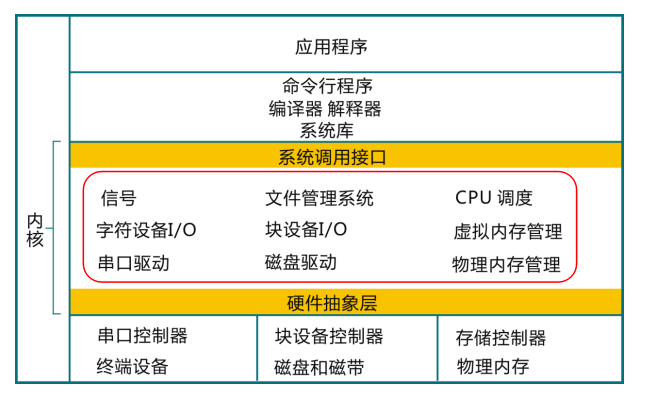

<!-- theme: gaia -->
<!-- _class: lead -->

## 第一讲 操作系统概述
### 第二节 什么是操作系统

 
 

向勇 陈渝 李国良 

 
 

2022年春季

---

## 操作系统定义

没有公认的精确定义

  操作系统是管理硬件资源、控制程序运行、改善人机界面和为应用软件提供支持的一种系统软件。[计算机百科全书]
 

承上启下的操作系统

---

## 操作系统定义

操作系统是一个控制程序
- 一个系统软件
- 执行程序, 给程序提供服务
- 控制程序执行过程, 防止错误
- 方便用户使用计算机系统

 

---

## 操作系统定义

操作系统是一个资源管理程序
- 应用与硬件之间的中间层
- 管理各种软硬件资源
- 访问软硬件资源的服务
- 解决访问冲突, 确保公平使用

---

## 操作系统中的件分类

- Shell – 命令行接口
- GUI – 图形用户接口
- Kernel–操作系统的内部

---
## uCore/rCore 教学操作系统内核

---
## 操作系统内核的抽象

---
## 操作系统内核的抽象

---
## 操作系统内核的特征

- 并发：计算机系统中同时存在多个运行程序
- 共享：程序间“同时”访问互斥共享各种资源
- 虚拟：每个程序” 独占” 一个完整的计算机
- 异步：服务的完成时间不确定，也可能失败 

---
## 你对操作系统内核的理解

###  用户/应用对操作系统的需求？

---
## 你对操作系统内核的理解

###  用户/应用对操作系统的需求？
- 高效 -- 易用 ?
- 强大的操作系统服务 -- 简单的接口 ?
- 灵活性 -- 安全性 ?

---
## 为什么要学习这门课程

- 可以发现和修复难对付的bug
- 可以了解计算机机壳后面的软硬件运行原理
- 可以学习软硬件基础架构

<!-- 如果你花费大量时间来开发，维护并调试应用程序，你最终还是要知道大量操作系统的知识 -->