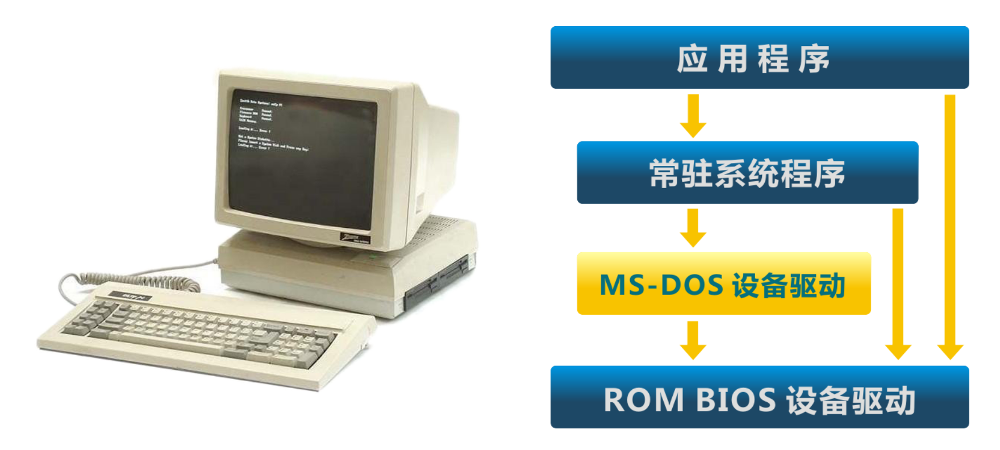
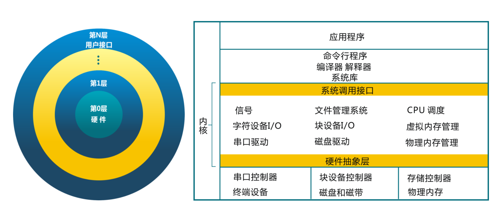
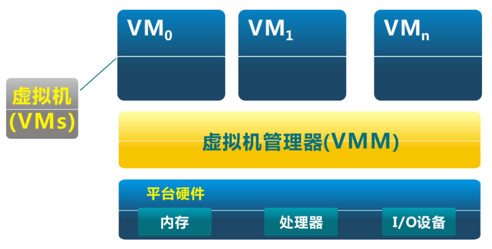
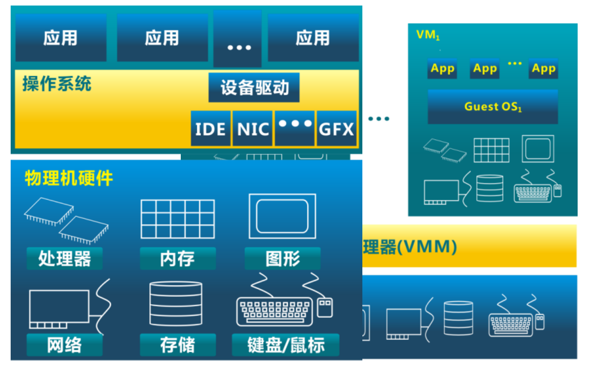
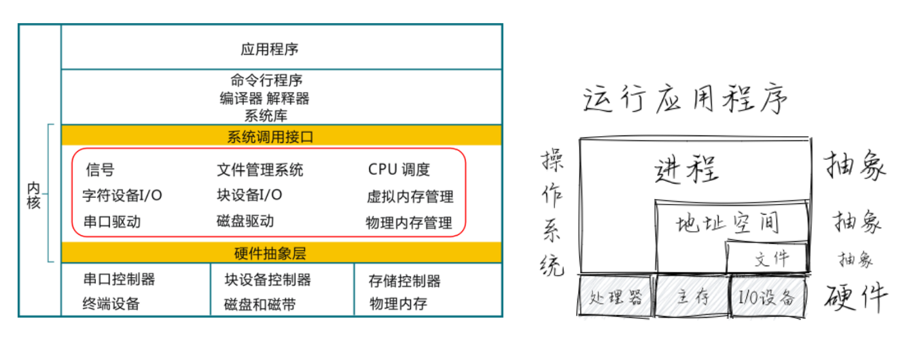

<!-- theme: gaia -->
<!-- page_number: true -->
<!-- _class: lead -->

## 第一讲 操作系统概述-1

### 第四节 操作系统结构

 
 

向勇 陈渝 李国良 

 
 

2022年春季

---
## 简单结构
MS-DOS：应用和OS混在一起 (1981–1994)
- 没有拆分为模块
- 主要用汇编编写
- 没有安全保护

---
## 单体分层结构
将单体操作系统 (Monolithic OS) 划分为多层 (levels)
- 每层建立在低层之上
- 最底层 (layer 0), 是硬件驱动
- 最高层 (layer N) 是用户界面
- 每一层仅使用更低一层的功能和服务

---
## 微内核结构
- 尽可能把内核功能移到用户空间
- 用户模块间的通信使用消息传递
- 好处: 灵活/安全...
- 缺点: 性能

---
## 外核结构
- 让内核分配物理资源给多个应用程序, 并让每个程序决定如何处理这些资源
- 程序能链接到操作系统库 (libOS) 实现了操作系统抽象
- 保护与控制分离

---
## 虚拟机结构
虚拟机管理器将单独的机器接口转换成很多的虚拟机, 每个虚拟机都是一个原
始计算机系统的有效副本, 并能完成所有的处理器指令

---
## 虚拟机结构

---
## 应用程序运行与 OS 抽象 + 架构的关系

