<!-- theme: gaia -->
<!-- _class: lead -->

# 第十二讲 同步与互斥
## 第一节 概述

<br>
<br>

向勇 陈渝 李国良 

<br>
<br>

2022年春季

---
### 背景
- 独立进/线程
  - 不和其他进/线程共享资源或状态
  - 确定性 => 输入状态决定结果
  - 可重现 =>  能够重现起始条件
  - 调度顺序不重要

- 进/线程如果有资源共享
  - 存在不确定性
  - 存在不可重现
  - 可能出现难以重现的错误

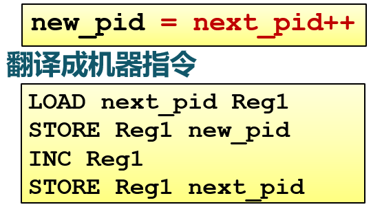

---
### 背景
- 有资源共享的进/线程执行fork时的可能错误

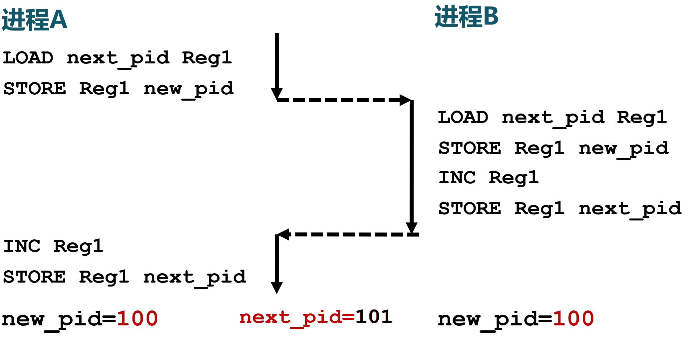


---
### 背景  -- 原子操作（Atomic Operation）

- 原子操作是指一次不存在任何中断或失败的操作
  - 要么操作成功完成
  - 或者操作没有执行
  - 不会出现部分执行的状态

操作系统需要利用同步机制在并发执行的同时，保证一些操作是原子操作


---
### 现实生活中的同步互斥
例如: 家庭采购协调  (利用现实生活问题帮助理解操作系统同步问题)
  - 注意，计算机与人的差异
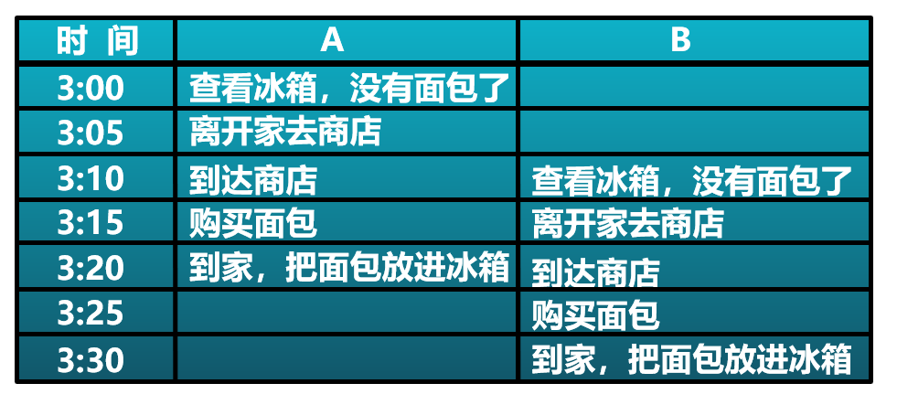

---
### 现实生活中的同步互斥
- 如何保证家庭采购协调的成功和高效
  - 需要采购时，有人去买面包
  - 最多只有一个人去买面包
- 可能的解决方法
  - 在冰箱上设置一个锁和钥匙（ lock&key）
  - 去买面包之前锁住冰箱并且拿走钥匙
- 加锁导致的新问题
  - 冰箱中还有其他食品时，别人无法取到


---
### 现实生活中的同步互斥 -- 方案一
- 使用便签来避免购买太多面包
  - 购买之前留下一张便签
  - 买完后移除该便签
  - 别人看到便签时，就不去购买面包
```
 if (nobread) {
    if (noNote) {
        leave Note;
        buy bread;
        remove Note;
    }
}
```


---
### 现实生活中的同步互斥 -- 方案一 -- 分析
- 偶尔会购买太多面包 - 重复
  - 检查面包和便签后帖便签前，有其他人检查面包和便签

- 解决方案只是间歇性地失败
  - 问题难以调试
  - 必须考虑调度器所做事情

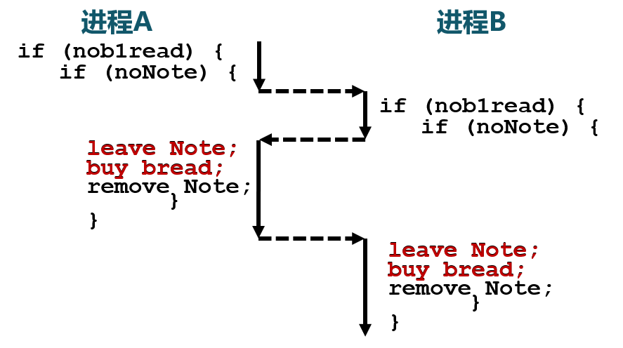


---
### 现实生活中的同步互斥 -- 方案二
- 先留便签，后查面包和便签
```
leave Note;
if (nobread) {  
  if (noNote) { 
       buy bread;
    }
}
remove note;
```
- 会发生什么？
   - 不会有人买面包

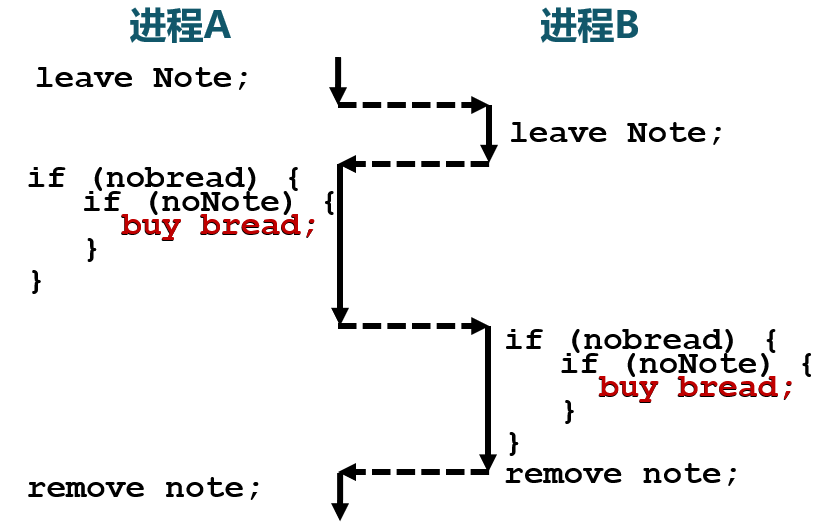


---
### 现实生活中的同步互斥 -- 方案三
- 为便签增加标记，以区别不同人的便签
   - 现在可在检查之前留便签
```
leave note_2;
if (no note_1) {
   if (no bread) { 
     buy bread; 
   } 
} 
remove note_2;	
```


---
### 现实生活中的同步互斥 -- 方案三
- 为便签增加标记，以区别不同人的便签
  - 现在可在检查之前留便签
```
leave note_1;
if (no note_2) {
   if (no bread) { 
     buy bread; 
   } 
} 
remove note_1;
```


---

### 现实生活中的同步互斥 -- 方案三
- 为便签增加标记，以区别不同人的便签
  - 现在可在检查之前留便签

 - 会发生什么？
   - 可能导致没有人去买面包
   - 每个人都认为另外一个去买面包
 


---

### 现实生活中的同步互斥 -- 方案四
两个人采用不同的处理流程


---
### 现实生活中的同步互斥 -- 方案四
两个人采用不同的处理流程
- 现在有效吗？
  - 它有效，但太复杂
- A和B的代码不同
  - 如果线程更多，怎么办？
- 当A等待时，不能做其他事
  - 忙等待（busy-waiting）


---
### 现实生活中的同步互斥 -- 方案五
- 利用两个原子操作实现一个锁(lock)
  -  Lock.Acquire()
     - 在锁被释放前一直等待，然后获得锁
     - 如果两个线程都在等待同一个锁，并且同时发现锁被释放了，那么只有一个能够获得锁
  -  Lock.Release()
     - 解锁并唤醒任何等待中的线程

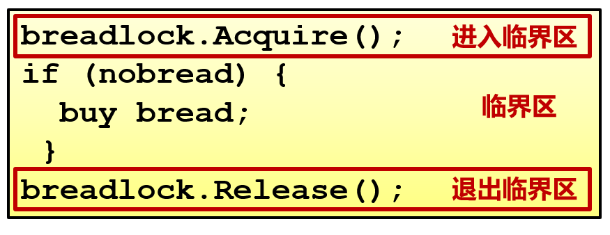

<!-- 
--- 
### 进/线程的交互关系：相互感知程度
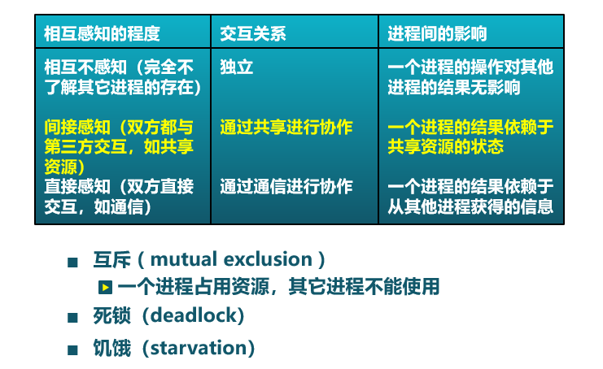


--- 
### 进/线程的交互关系：相互感知程度


--- 
### 进/线程的交互关系：相互感知程度

 -->


---  
### 临界区(Critical Section)
```
entry section
   critical section
exit section
   remainder section
```
- 进入区(entry section)
  - 检查可否进入临界区的一段代码
  - 如可进入，设置相应"正在访问临界区"标志
- 临界区(critical section)
  - 线程中访问临界资源的一段需要互斥执行的代码


---  
### 临界区(Critical Section)
```
entry section
   critical section
exit section
   remainder section
```
- 退出区(exit section)
   - 清除“正在访问临界区”标志
- 剩余区(remainder section)
   - 代码中的其余部分

---  
### 临界区(Critical Section) -- 访问规则
```
entry section
   critical section
exit section
   remainder section
```
- 1 空闲则入
   - 没有线程在临界区时，任何线程可进入
- 2 忙则等待
   -  有线程在临界区时，其他线程均不能进入临界区
  

---  
### 临界区(Critical Section) -- 访问规则
```
entry section
   critical section
exit section
   remainder section
```
- 3 有限等待
   -  等待进入临界区的线程不能无限期等待
- 4 让权等待（可选）
   - 不能进入临界区的线程，应释放CPU（如转换到阻塞状态）


---  
### 同步互斥的方法
- 方法1：禁用硬件中断
- 方法2：基于软件的解决方法
- 方法3：更高级的抽象方法


---  
### 方法1：禁用硬件中断
- 没有中断，没有上下文切换，因此没有并发
   - 硬件将中断处理延迟到中断被启用之后
   - 现代计算机体系结构都提供指令来实现禁用中断

          local_irq_save(unsigned long flags); 
              critical section
          local_irq_restore(unsigned long flags); 
- 进入临界区：禁止所有中断，并保存标志 
- 离开临界区：使能所有中断，并恢复标志 
 

---  
### 方法1：禁用硬件中断
- 缺点
  - 禁用中断后，线程无法被停止
     - 整个系统都会为此停下来
     - 可能导致其他线程处于饥饿状态
  - 临界区可能很长
     - 无法确定响应中断所需的时间（可能存在硬件影响）
  - 不适合多核
 **要小心使用**


---  
### 方法2：基于软件的解决方法

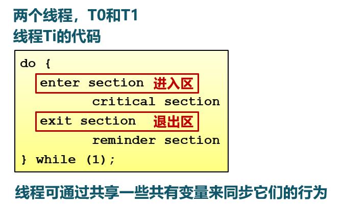


---  
### 方法2：基于软件的解决方法 -- 尝试一
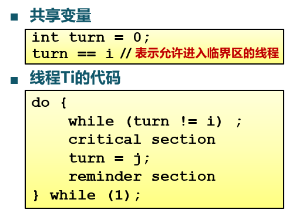
- 满足“忙则等待”，但是有时不满足“空闲则入”
   - Ti不在临界区，Tj想要继续运行，但是必须等待Ti进入过临界区后
   - turn = 0;
     - T0 不需要访问
     - T1 需要访问->一直等待


---  
### 方法2：基于软件的解决方法 -- 尝试二

- 互相依赖（线程盲等）
- 不满足“忙则等待”
  - flag[i]=flag[j]=0
```c
// 线程 Tj
do {
   while (flag[i] == 1) ;
   flag[j] = 1;
   critical section
   flag[j] = 0;
   remainder section
} while(1)
```


---  
### 方法2：基于软件的解决方法 -- 尝试三

- 满足“忙则等待”，但是不满足“空闲则入”
  - flag[i]=flag[j]=1
```c
// 线程 Tj
do {
   flag[j] = 1;
   while (flag[i] == 1) ;
   critical section
   flag[j] = 0;
   remainder section
} while(1)
```

---  
### 方法2：基于软件的解决方法 -- Peterson算法


- 满足线程Ti和Tj之间互斥的经典的基于软件的解决方法（1981年）
- 孔融让梨


---  
### 方法2：基于软件的解决方法 -- Peterson算法

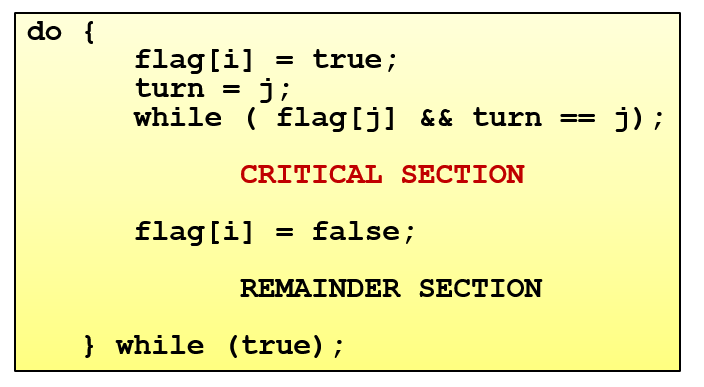
```
flag[i] = True;
turn = j;
while(flag[j] && turn == j);
critical section;
flag[i] = False;
remainder section;
```
```
flag[j] = True;
turn = i;
while(flag[i] && turn == i);
critical section;
flag[j] = False;
remainder section;
```


---  
### 方法2：基于软件的解决方法 -- Dekkers算法

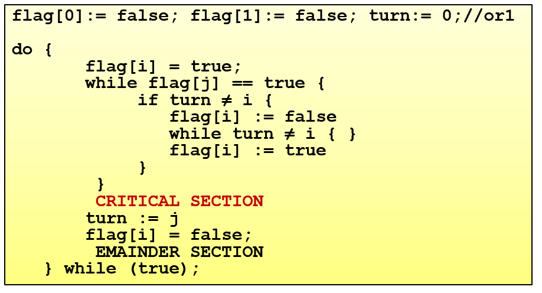
```
do{
  flag[0] = true;// 首先P0举手示意我要访问
  while(flag[1]) {// 看看P1是否也举手了
     if(turn==1){// 如果P1也举手了，那么就看看到底轮到谁
         flag[0]=false;// 如果确实轮到P1，那么P0先把手放下（让P1先）
         while(turn==1);// 只要还是P1的时间，P0就不举手，一直等
         flag[0]=true;// 等到P1用完了（轮到P0了），P0再举手
     }
     flag[1] = false; // 只要可以跳出循环，说明P1用完了，应该跳出最外圈的while
  }
  critical section;// 访问临界区
  turn = 1;// P0访问完了，把轮次交给P1，让P1可以访问
  flag[0]=false;// P0放下手
  remainder section;
} while(true);
```
---  
### 方法2：基于软件的解决方法 -- N线程
Eisenberg和McGuire
- 一个共享的turn变量，若干线程排成一个环
- 每个环有个flag标志，想要进入临界区填写flag标志
- 有多个想进入临界区，从前往后走，执行完一个线程，turn改为下一个线程的值。


---  
### 方法2：基于软件的解决方法 -- N线程
```c 
INITIALIZATION:

enum states flags[n -1]; //{IDLE, WAITING, ACTIVE}
int turn;
for (index=0; index<n; index++) {
   flags[index] = IDLE;
}
```

---  
### 方法2：基于软件的解决方法 -- N线程
```c 
ENTRY PROTOCOL (for Process i ):

repeat {
   flags[i] = WAITING;//表明自己需要资源
   index = turn;//轮到谁了
   while (index != i) {//从turn到i轮流找不idle的线程
      if (flag[index] != IDLE) index = turn;//turn到i有非idle的阻塞
      else index = (index+1) mod n; //否则轮到i，并跳出
   }
   flags[i] = ACTIVE;//Pi 索要资源
   index = 0;//看看是否还有其他active的
   while ((index < n) && ((index == i) || (flags[index] != ACTIVE))) {
      index = index+1;
   }//如果后面没有active了，并且轮到Pi或者turn idle, 就轮到i;否则继续循环
} until ((index >= n) && ((turn == i) || (flags[turn] == IDLE)));
turn = i;//获得turn并处理
```

---  
### 方法2：基于软件的解决方法 -- N线程
```c 
EXIT PROTOCOL (for Process i ):

index = turn+1 mod n;//找到一个不idle的
while (flags[index] == IDLE) {
   index = index+1 mod n;
}
turn = index;//找到不idle的设置为turn；或者设置为自己
flag[i] = IDLE;//结束，自己变idle
```

---  
### 方法3：更高级的抽象方法
- 基于软件的解决方法
   - 复杂，需要忙等待

- 更高级的抽象方法
   - 硬件提供了一些同步原语
       - 中断禁用，原子操作指令等
   - 操作系统提供更高级的编程抽象来简化线程同步
       - 例如：锁、信号量
       - 用硬件原语来构建

---  
### 方法3：更高级的抽象方法 -- 锁(lock)
- 锁是一个抽象的数据结构
   - 一个二进制变量（锁定/解锁）
   - 使用锁来控制临界区访问
   - Lock::Acquire()
      - 锁被释放前一直等待，后得到锁
   - Lock::Release()
      -  释放锁，唤醒任何等待的线程


---  
### 方法3：更高级的抽象方法 -- 锁(lock)
现代CPU提供一些特殊的原子操作指令
- 原子操作指令 
  - 测试和置位（Test-and-Set ）指令
     - 从内存单元中读取值
     - 测试该值是否为1(然后返回真或假)
     - 内存单元值设置为1
       - 输入0，改成1，返回0；
       - 输入1，保持1，返回1；


 

---  
### 方法3：更高级的抽象方法 -- 锁(lock)
现代CPU都提供一些特殊的原子操作指令
```
do {
  while(TestAndSet(&lock) ;
  critical section; 
  lock = false;
  remainder section;
} while (true)
```


 
---  
### 方法3：更高级的抽象方法 -- 锁(lock)
现代CPU都提供一些特殊的原子操作指令
```
do {
  while(TestAndSet(&lock) ;
  critical section; 
  lock = false;
  remainder section;
} while (true)
```
```
lock(): while(TestAndSet(&lock));
critical section; 
unlock(): lock=false;
```


---  
### 方法3：更高级的抽象方法 -- 锁(lock)
- 原子操作：交换指令CAS（compare and swap）
```
bool compare_and_swap(int *value, int old, int new) {
   if(*value==old) {
      *value = new; 
      return true; }
   return false;
}
```
```
int lock = 0;
while(!compare_and_swap(&lock,0,1)); 
critical section; 
lock=0;
remainder section;
```

---  
### 方法3：更高级的抽象方法 -- 锁(lock)
- 原子操作：交换指令CaS（Compare and Swap）
```
bool compare_and_swap(int *value, int old, int new) {
   if(*value==old) {
      *value = new; 
      return true;
   }
   return false;
}
```
```
lock(): while(!compare_and_swap(&lock,0,1)); 
critical section; 
unlock(): lock=0; 
```

---  
### 方法3：更高级的抽象方法 -- 锁(lock)
- 原子操作：交换指令CaS（Compare and Swap）
- ABA 问题：
  - value= 100；
  - Thread1: value - 50; //成功 value=50
  - Thread2: value - 50; //阻塞
  - Thread3: value + 50; //成功 value=50
  - Thread2: 重试成功
- 解决思路：加上版本号（时间戳）
  - (100,1); (50,2); (100,3) 
<!---  
### 方法3：更高级的抽象方法 -- 锁(lock)
现代CPU体系结构都提供一些特殊的原子操作指令
- 原子操作指令 
  - 交换指令（exchange）
     - 交换内存中的两个值


-->

---  
### 方法3：更高级的抽象方法 -- 锁(lock) 
使用TaS指令实现自旋锁(spinlock)
- 线程在等待的时候消耗CPU时间
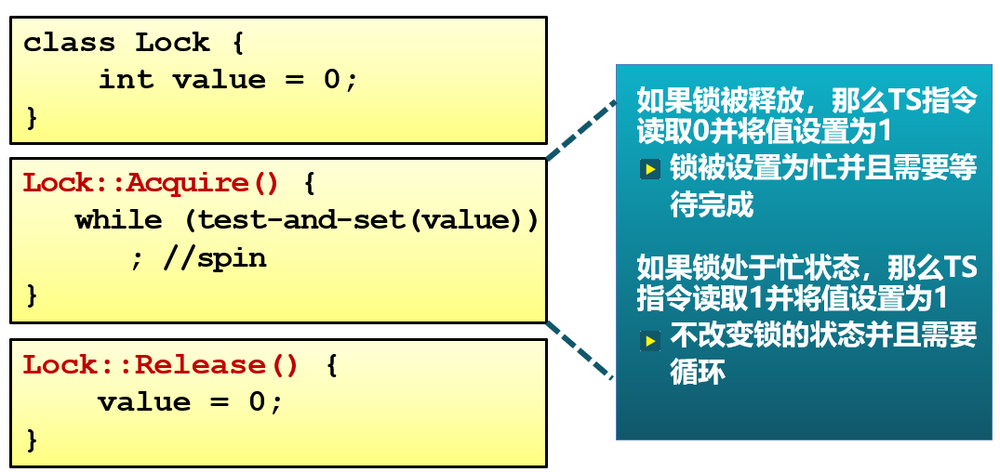


---  
### 方法3：更高级的抽象方法 -- 锁(lock) 
**忙等锁 v.s. 等待锁**
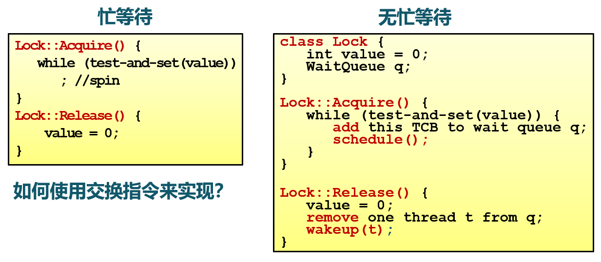

---  
### 方法3：更高级的抽象方法 -- 锁(lock) 
- 优点
  - 适用于单处理器或者共享主存的多处理器中任意数量的线程同步
  - 简单并且容易证明
  - 支持多临界区
- 缺点
  - 忙等待消耗处理器时间
  - 可能导致饥饿
    -  线程离开临界区时有多个等待线程的情况
  - 可能死锁：线程间相互等待，无法继续执行 

---
### 小结
- 常用的三种同步实现方法
  - 禁用中断（仅限于单处理器）
  - 软件方法（复杂）
  - 锁是一种高级的同步抽象方法
     - 硬件原子操作指令（单处理器或多处理器均可）
     - 互斥可以使用锁来实现


