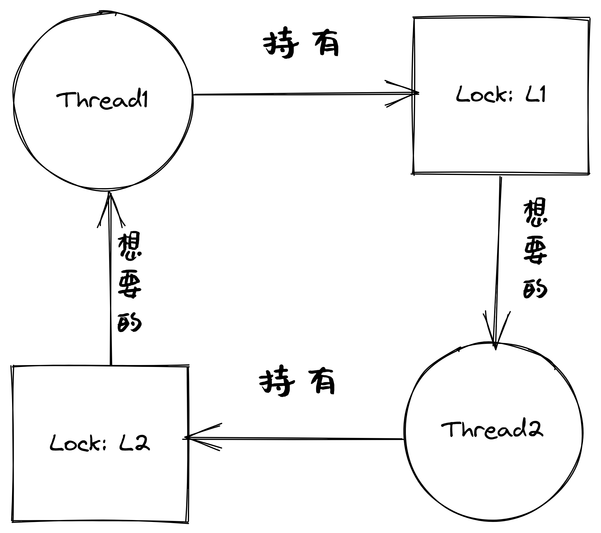
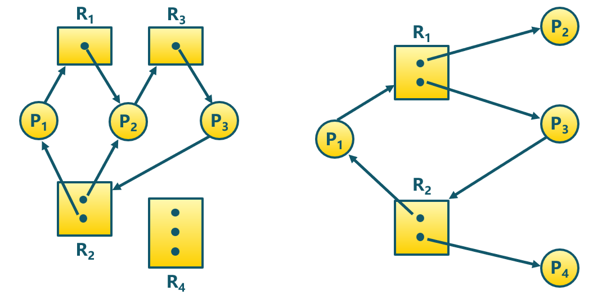
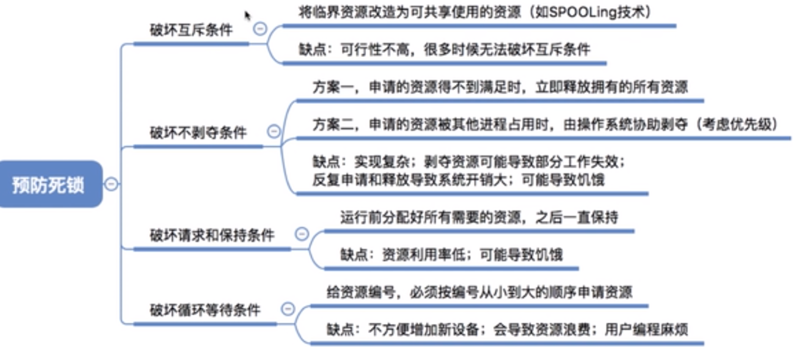
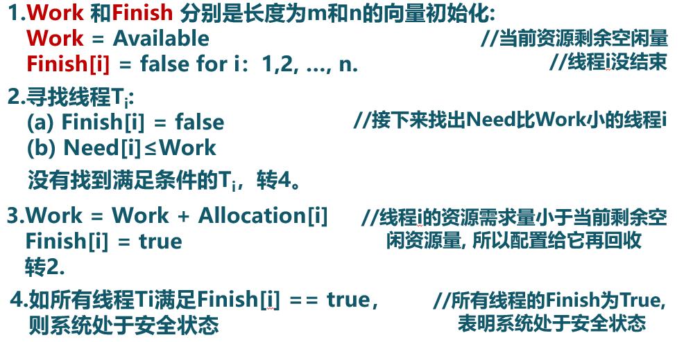
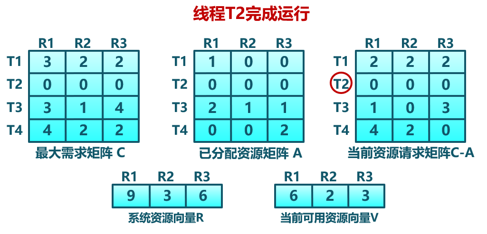
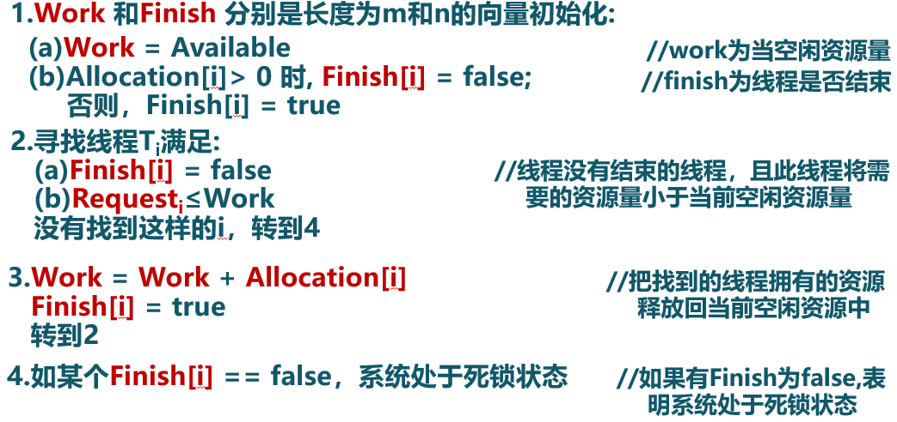
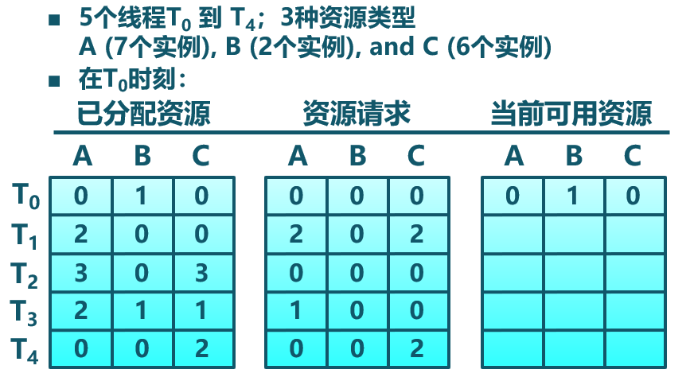

<!-- theme: gaia -->
<!-- _class: lead -->

# 第十二讲 同步与互斥

## 第五节 死锁


---
### 死锁问题

- 桥梁只能单向通行
- 桥的每个部分可视为一个资源
- 可能出现死锁
  - 对向行驶车辆在桥上相遇
  - 解决方法：一个方向的车辆倒退(资源抢占和回退)


---
### 死锁问题

- 桥梁只能单向通行
- 桥的每个部分可视为一个资源
- 可能发生饥饿
  - 由于一个方向的持续车流，另一个方向的车辆无法通过桥梁


---
### 死锁问题
由于竞争资源或者通信关系，两个或更多进/线程在执行中出现，永远相互等待只能由其他进/线程引发的事件
```
Thread 1:    Thread 2:
lock(L1);    lock(L2);
lock(L2);    lock(L1);
```


---
###  死锁问题 -- 资源
- 资源类型$R_1, R_2, . . .,R_m$
   - CPU执行时间、内存空间、I/O设备等
- 每类资源$R_i$有$W_i$个实例
- 进/线程访问资源的流程
   - 请求：申请空闲资源
   - 使用：占用资源
   - 释放：资源状态由占用变成空闲


---
###  死锁问题 -- 资源
**资源分类**
- 可重用资源（Reusable Resource）
   - 任何时刻只能有一个进/线程使用资源
   - 资源被释放后，其他进/线程可重用
   - 可重用资源示例
      - 硬件：处理器、内存、设备等
      - 软件：文件、数据库和信号量等
   - 可能出现死锁：每个进/线程占用一部分资源并请求其它资源


---
###  死锁问题 -- 资源
**资源分类**
- 可消耗资源(Consumable resource)
   - 资源可被销毁
   - 可消耗资源示例
      - 在I/O缓冲区的中断、信号、消息等
   - 可能出现死锁：进/线程间相互等待接收对方的消息


---
###  死锁问题 -- 资源分配图
描述资源和进/线程间的分配和占用关系的有向图
- 顶点：系统中的进/线程
   - $P = \{ P_1, P_2, …, P_n \}$
- 顶点：系统中的资源
   - $R = \{R_1, R_2, …, P_m\}$
- 边：资源请求
   - 进/线程$P_i$请求资源$R_j: P_i \rightarrow R_j$
- 边：资源分配
   - 资源$R_j$已分配给进/线程$P_i：R_j \rightarrow  P_i$


---
###  死锁问题 -- 资源分配图

是否有死锁？


---
###  死锁问题 -- 必要条件
- 互斥：任何时刻只能有一个进/线程使用一个资源实例
- 持有并等待：进/线程保持至少一个资源，并正在等待获取其他进/线程持有的资源
- 非抢占：资源只能在进/线程使用后自愿释放
- 循环等待
   - 存在等待进/线程集合$\{P_0，P_1，...，P_N\}$ 
   - 进/线程间形成相互等待资源的环


---
###  死锁问题 -- 处理办法 
- 死锁预防(Deadlock Prevention)
   - 确保系统永远不会进入死锁状态
- 死锁避免(Deadlock Avoidance)
   - 在使用前进行判断，只允许不会出现死锁的进/线程请求资源
- 死锁检测和恢复(Deadlock Detection & Recovery)
   - 在检测到运行系统进入死锁状态后，进行恢复
   - 由应用进/线程处理死锁
   - 通常操作系统忽略死锁
      - 大多数操作系统（包括UNIX）的做法

---
###  死锁问题 - 处理办法 -- 预防
预防采用某种策略限制并发进/线程对资源的请求，或破坏死锁必要条件。
- 破坏“互斥”
   - 把互斥的共享资源封装成可同时访问，例如用SPOOLing技术将打印机改造为共享设备；
   - 缺点：但是很多时候都无法破坏互斥条件。
- 破坏“持有并等待“
   - 只在能够同时获得所有需要资源时，才执行分配操作
   <!-- 仅允许进/线程在开始执行时，一次请求所有需要的资源
      - 进/线程请求资源时，要求它不持有任何其他资源-->
   - 缺点：资源利用率低


---
###  死锁问题 - 处理办法 -- 预防
<!--预防是采用某种策略，限制并发进/线程对资源的请求，或使系统在任何时刻都不满足死锁的必要条件。-->
预防采用某种策略限制并发进/线程对资源的请求，或破坏死锁必要条件。
- 破坏“非抢占”
   - 如进/线程请求不能立即分配的资源，则释放已占有资源
   - 申请的资源被其他进/线程占用时，由OS协助剥夺
   - 缺点：反复地申请和释放资源会增加系统开销，降低系统吞吐量。
- 破坏“循环等待“
   - 对资源排序，要求进/线程按顺序请求资源
   - 缺点：必须按规定次序申请资源，用户编程麻烦
   - 缺点：难以支持资源变化（例如新资源）
 
 
<!---
###  死锁问题 - 处理办法 -- 预防

-->


---
###  死锁问题 - 处理办法 -- 避免
利用额外的先验信息，在分配资源时判断是否会出现死锁，只在不会死锁时分配资源
- 要求进/线程声明需要资源的最大数目
- 限定提供与分配的资源数量，确保满足进/线程的最大需求
- 动态检查的资源分配状态，确保不会出现环形等待

 
---
###  死锁问题 - 处理办法 -- 避免
资源分配中，系统处于安全状态
- 针对所有已占用进/线程，存在安全执行序列$<P_1，P_2，...，P_N>$
- $P_i$要求的资源 $\le$ 当前可用资源 $+$ 所有$P_j$ 持有资源，其中$j<i$
- 如$P_i$的资源请求不能立即分配，则$P_i$等待所有$P_j, (j<i)$完成
- $P_i$完成后，$P_{i+1}$可得到所需资源，执行完并释放所分配的资源
- 最终整个序列的所有Pi都能获得所需资源


---
###  死锁问题 - 处理办法 -- 避免
安全状态与死锁的关系
- 系统处于安全状态，一定没有死锁
- 系统处于不安全状态，可能出现死锁
   - 避免死锁就是确保系统不会进入不安全状态


---
###  死锁问题 - 处理办法 -- 避免
银行家算法（Banker's Algorithm）-- 概述
- 银行家算法是一个避免死锁产生的算法。以银行借贷分配策略为基础，判断并保证系统处于安全状态
   - 客户在第一次申请贷款时，声明所需最大资金量，在满足所有贷款要求并完成项目时，及时归还
   - 在客户贷款数量不超过银行拥有的最大值时，银行家尽量满足客户需要

银行家 $\leftrightarrow$操作系统；资金 $\leftrightarrow$资源；客户 $\leftrightarrow$进/线程

---
###  死锁问题 - 处理办法 -- 避免
银行家算法（Banker's Algorithm）-- 数据结构


---
###  死锁问题 - 处理办法 -- 避免
银行家算法（Banker's Algorithm）-- 判断安全状态的例程



---
###  死锁问题 - 处理办法 -- 避免
银行家算法（Banker's Algorithm）-- 完整算法


---
###  死锁问题 - 处理办法 -- 避免
银行家算法（Banker's Algorithm）-- 示例1


---
###  死锁问题 - 处理办法 -- 避免
银行家算法（Banker's Algorithm）-- 示例1


---
###  死锁问题 - 处理办法 -- 避免
银行家算法（Banker's Algorithm）-- 示例1


---
###  死锁问题 - 处理办法 -- 避免
银行家算法（Banker's Algorithm）-- 示例1


---
###  死锁问题 - 处理办法 -- 避免
银行家算法（Banker's Algorithm）-- 示例2


---
###  死锁问题 - 处理办法 -- 避免
银行家算法（Banker's Algorithm）-- 示例2


---
###  死锁问题 - 处理办法 -- 检测
- 允许系统进入死锁状态
- 维护系统的资源分配图
- 定期调用死锁检测算法来搜索图中是否存在死锁
- 出现死锁时，用死锁恢复机制进行恢复


---
###  死锁问题 - 处理办法 -- 检测
死锁检测算法：数据结构
- Available:长度为m的向量：每种类型可用资源的数量
- Allocation:一个n×m矩阵：当前分配给各个进/线程每种类型资源的数量
   - 进/线程$P_i$ 拥有资源$R_j$的$Allocation[i, j]$个实例


---
###  死锁问题 - 处理办法 -- 检测
死锁检测算法：完整算法



---
###  死锁问题 - 处理办法 -- 检测
死锁检测算法：-- 示例1


---
###  死锁问题 - 处理办法 -- 检测
死锁检测算法：-- 示例1



---
###  死锁问题 - 处理办法 -- 检测
死锁检测算法：-- 示例1


---
###  死锁问题 - 处理办法 -- 检测
死锁检测算法：-- 示例1


---
###  死锁问题 - 处理办法 -- 检测
死锁检测算法：-- 示例1


---
###  死锁问题 - 处理办法 -- 检测
死锁检测算法：-- 示例1

序列$<T_0, T_2, T_1, T_3, T_4>$ 对于所有的i，都可满足Finish[i] = true


---
###  死锁问题 - 处理办法 -- 检测
死锁检测算法：-- 示例2

可通过回收线程$T_0$占用的资源，但资源不足以完成其他线程请求
线程$T_1, T_2, T_3, T_4$形成死锁


---
###  死锁问题 - 处理办法 -- 检测
使用死锁检测算法

- 死锁检测的时间和周期选择依据
   - 死锁多久可能会发生
   - 多少进/线程需要被回滚
- 资源图可能有多个循环
   - 难于分辨“造成”死锁的关键进/线程

检测到死锁后，应该如何处理？

---
###  死锁问题 - 处理办法 -- 恢复 -- 进/线程终止

- 终止所有的死锁进/线程
- 一次只终止一个进/线程直到死锁消除
- 终止进/线程的顺序的参考因素：
   - 进/线程的优先级
   - 进/线程已运行时间以及还需运行时间
   - 进/线程已占用资源
   - 进/线程完成需要的资源
   - 终止进/线程数目
   - 进/线程是交互还是批处理

---
###  死锁问题 - 处理办法 -- 恢复 -- 资源抢占
- 选择被抢占进/线程
   - 参考因素：最小成本目标
- 进/线程回退
   - 返回到一些安全状态, 重启进/线程到安全状态
-  可能出现饥饿
   - 同一进/线程可能一直被选作被抢占者


 

