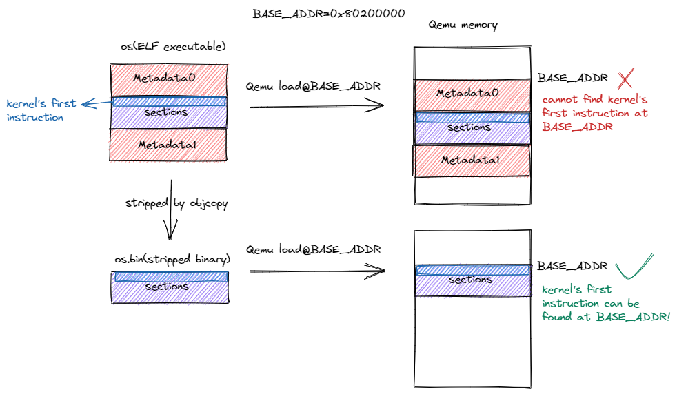

<!-- theme: gaia -->
<!-- _class: lead -->

## 第二讲 实践与实验介绍
### 第四节 实践一：LibOS

---
## 实践一：LibOS
### 目标
- 让应用与硬件隔离
- 简化应用访问硬件的难度和复杂性


---
## 实践一：LibOS
### 步骤
- 建好开发与实验环境
- 移出标准库依赖
- 支持函数调用
- 基于SBI服务完成输出与关机


---
## 实践一：LibOS
### 具体步骤
```
git clone https://github.com/rcore-os/rCore-Tutorial-v3.git
cd rCore-Tutorial-v3
git checkout ch1

cd os
make run
```

---
## 实践一：LibOS
### 执行结果
```
[RustSBI output]
Hello, world!
.text [0x80200000, 0x80202000)
.rodata [0x80202000, 0x80203000)
.data [0x80203000, 0x80203000)
boot_stack [0x80203000, 0x80213000)
.bss [0x80213000, 0x80213000)
Panicked at src/main.rs:46 Shutdown machine!
```

除了显示 Hello, world! 之外还有一些额外的信息，最后关机。


---
## 实践一：LibOS
```
./os/src
Rust        4 Files   119 Lines
Assembly    1 Files    11 Lines

├── bootloader(内核依赖的运行在 M 特权级的 SBI 实现，本项目中我们使用 RustSBI)
│   ├── rustsbi-k210.bin(可运行在 k210 真实硬件平台上的预编译二进制版本)
│   └── rustsbi-qemu.bin(可运行在 qemu 虚拟机上的预编译二进制版本)
```


---
## 实践一：LibOS
```
├── os(我们的内核实现放在 os 目录下)
│   ├── Cargo.toml(内核实现的一些配置文件)
│   ├── Makefile
│   └── src(所有内核的源代码放在 os/src 目录下)
│       ├── console.rs(将打印字符的 SBI 接口进一步封装实现更加强大的格式化输出)
│       ├── entry.asm(设置内核执行环境的的一段汇编代码)
│       ├── lang_items.rs(需要我们提供给 Rust 编译器的一些语义项，目前包含内核 panic 时的处理逻辑)
│       ├── linker-qemu.ld(控制内核内存布局的链接脚本以使内核运行在 qemu 虚拟机上)
│       ├── main.rs(内核主函数)
│       └── sbi.rs(调用底层 SBI 实现提供的 SBI 接口)
```

---
## 实践一：LibOS -- App/OS内存布局


---
## 实践一：LibOS -- 定制内存布局
```
OUTPUT_ARCH(riscv)
ENTRY(_start)
BASE_ADDRESS = 0x80200000;

SECTIONS
{
    . = BASE_ADDRESS;
    skernel = .;

    stext = .;
    .text : {
      *(.text.entry)
```


---
## 实践一：LibOS -- 定制内存布局
```
    .bss : {
        *(.bss.stack)
        sbss = .;
        *(.bss .bss.*)
        *(.sbss .sbss.*)
```


---
## 实践一：LibOS -- 生成内核二进制镜像



---
## 实践一：LibOS -- 生成内核二进制镜像
```
rust-objcopy --strip-all \
target/riscv64gc-unknown-none-elf/release/os \
-O binary target/riscv64gc-unknown-none-elf/release/os.bin
```

---
## 实践一：LibOS -- 基于 GDB 验证启动流程
```
qemu-system-riscv64 \
    -machine virt \
    -nographic \
    -bios ../bootloader/rustsbi-qemu.bin \
    -device loader,file=target/riscv64gc-unknown-none-elf/release/os.bin,addr=0x80200000 \
    -s -S
```

```
riscv64-unknown-elf-gdb \
    -ex 'file target/riscv64gc-unknown-none-elf/release/os' \
    -ex 'set arch riscv:rv64' \
    -ex 'target remote localhost:1234'
[GDB output]
0x0000000000001000 in ?? ()
```

---
## 实践一：LibOS -- 支持函数调用


---
## 实践一：LibOS -- 支持函数调用


伪指令 ret 翻译为 jalr x0, 0(x1)，含义为跳转到寄存器 ra 保存的物理地址，由于 x0 是一个恒为 0 的寄存器，在 rd 中保存这一步被省略。


---
## 实践一：LibOS -- 支持函数调用


在进行函数调用的时候，我们通过 jalr 指令保存返回地址并实现跳转；而在函数即将返回的时候，则通过 ret 伪指令回到跳转之前的下一条指令继续执行。这样，RISC-V 的这两条指令就实现了函数调用流程的核心机制。

---
## 实践一：LibOS -- 支持函数调用
函数调用规范

函数调用规范 (Calling Convention) 约定在某个指令集架构上，某种编程语言的函数调用如何实现。它包括了以下内容：

- 函数的输入参数和返回值如何传递；
- 函数调用上下文中调用者/被调用者保存寄存器的划分；
- 其他的在函数调用流程中对于寄存器的使用方法。

---
## 实践一：LibOS -- 支持函数调用
RISC-V函数调用规范


---
## 实践一：LibOS -- 支持函数调用
RISC-V函数调用规范


---
## 实践一：LibOS -- 支持函数调用
RISC-V函数调用规范


---
## 实践一：LibOS -- 支持函数调用

它的开头和结尾分别在 sp(x2) 和 fp(s0) 所指向的地址。按照地址从高到低分别有以下内容，它们都是通过 sp 加上一个偏移量来访问的：
- ra 寄存器保存其返回之后的跳转地址，是一个调用者保存寄存器；
- 父亲栈帧的结束地址 fp ，是一个被调用者保存寄存器；
- 其他被调用者保存寄存器 s1 ~ s11 ；
- 函数所使用到的局部变量。

---
## 实践一：LibOS -- 支持函数调用

分配并使用启动栈
```
# os/src/entry.asm
    .section .text.entry
    .globl _start
_start:
    la sp, boot_stack_top
    call rust_main

    .section .bss.stack
    .globl boot_stack
boot_stack:
    .space 4096 * 16
    .globl boot_stack_top
boot_stack_top:
```

---
## 实践一：LibOS -- 支持函数调用

分配并使用启动栈
```
.bss : {
    *(.bss.stack)
    sbss = .;
    *(.bss .bss.*)
    *(.sbss .sbss.*)
}
ebss = .;
```
在链接脚本 linker.ld 中 .bss.stack 段最终会被汇集到 .bss 段中
.bss 段一般放置需要被初始化为零的数据


---
## 实践一：LibOS -- 支持函数调用

将控制权转交给 Rust 代码，该入口点在 main.rs 中实现
```
// os/src/main.rs
#[no_mangle]
pub fn rust_main() -> ! {
    loop {}
}
```


---
## 实践一：LibOS -- 支持函数调用

清空bss段
```
pub fn rust_main() -> ! {
    clear_bss();
}

fn clear_bss() {
    extern "C" {
        fn sbss();
        fn ebss();
    }
    (sbss as usize..ebss as usize).for_each(|a| {
        unsafe { (a as *mut u8).write_volatile(0) }
    });
}
```

---
## 实践一：LibOS -- 支持函数调用
在屏幕上打印 Hello world! 

### RustSBI
- 提供基本的底层服务
- 需要遵循SBI调用约定

---
## 实践一：LibOS -- 支持函数调用
RustSBI服务
```
// os/src/sbi.rs
#![allow(unused)]
const SBI_SET_TIMER: usize = 0;
const SBI_CONSOLE_PUTCHAR: usize = 1;
const SBI_CONSOLE_GETCHAR: usize = 2;
const SBI_CLEAR_IPI: usize = 3;
const SBI_SEND_IPI: usize = 4;
const SBI_REMOTE_FENCE_I: usize = 5;
const SBI_REMOTE_SFENCE_VMA: usize = 6;
const SBI_REMOTE_SFENCE_VMA_ASID: usize = 7;
const SBI_SHUTDOWN: usize = 8;
```

---
## 实践一：LibOS -- 支持函数调用

``` rust
// os/src/sbi.rs
use core::arch::asm;
#[inline(always)]
fn sbi_call(which: usize, arg0: usize, arg1: usize, arg2: usize) -> usize {
    let mut ret;
    unsafe {
        asm!(
            "ecall",
            inlateout("x10") arg0 => ret,
            in("x11") arg1,
            in("x12") arg2,
            in("x17") which,
        );
    }
    ret
}
```
---
## 实践一：LibOS -- 支持函数调用
在屏幕上输出一个字符
```
// os/src/sbi.rs
pub fn console_putchar(c: usize) {
    sbi_call(SBI_CONSOLE_PUTCHAR, c, 0, 0);
}
```
#### 实现格式化输出
- 编写基于 console_putchar 的 println! 宏

---
## 实践一：LibOS -- 支持函数调用
关机
```
// os/src/sbi.rs
pub fn shutdown() -> ! {
    sbi_call(SBI_SHUTDOWN, 0, 0, 0);
    panic!("It should shutdown!");
}
```

---
## 实践一：LibOS -- 支持函数调用
优雅地处理错误panic
```
#[panic_handler]
fn panic(info: &PanicInfo) -> ! {
    if let Some(location) = info.location() {
        println!(
            "Panicked at {}:{} {}",
            location.file(),
            location.line(),
            info.message().unwrap()
        );
    } else {
        println!("Panicked: {}", info.message().unwrap());
    }
    shutdown()
}
```

---
## 实践一：LibOS -- 支持函数调用
优雅地处理错误panic
```
pub fn rust_main() -> ! {
    clear_bss();
    println!("Hello, world!");
    panic!("Shutdown machine!");
}
```
运行结果
```
[RustSBI output]
Hello, world!
Panicked at src/main.rs:26 Shutdown machine!
```
