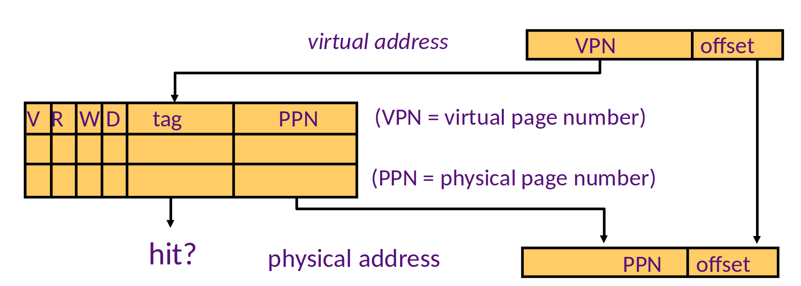

<!-- theme: gaia -->
<!-- _class: lead -->

## 第三讲 特权级
### 第一节 从 OS 角度看计算机系统

---
## 计算机系统

 广义的定义, 计算机系统（computer architecture）是一种抽象层次的设计，用于实现可有效使用现有制造技术的信息处理应用。
 -- cs-152 berkeley

---
## 计算机系统抽象层次

 广义的定义, 计算机系统（computer architecture）是一种抽象层次的设计，用于实现可有效使用现有制造技术的信息处理应用。
 -- cs-152 berkeley 

---
## 软硬件接口

---
## OS与体系结构的关系

---
## 再看计算机系统 -- RISC-V

---
## 再看计算机系统 -- uCore

---
## OS与应用程序的关系

---
## OS与应用程序的关系
- 程序调用 ssize_t read(int fd, void *buf, size_t count); 会发生什么？
- 我们可以在应用程序中直接调用内核的函数吗？
- 我们可以在内核中使用应用程序普通的函数调用吗？

---
## OS与应用程序的关系

- 程序调用 ssize_t read(int fd, void *buf, size_t count); 会发生什么？
- 我们可以在应用程序中直接调用内核的函数吗？
- 我们可以在内核中使用应用程序普通的函数调用吗？
- 程序调用的特征
  - 好处：执行很快；
  - 好处：灵活-易于传递和返回复杂数据类型；
  - 好处：程序员熟悉的机制,...
  - 坏处：应用程序不可靠，可能有恶意，有崩溃的风险

---
## OS与应用程序的关系

---
## OS与应用程序的关系

---
## OS与应用程序的关系

---
## OS与应用程序的关系 -- 内存关系？

 

---
## 隔离 ：什么是隔离？

- 强制隔离以避免对整个系统的可用性/可靠性/安全影响
- 运行的程序通常是是隔离的单元

---
## 隔离 ：什么是隔离？

- 强制隔离以避免对整个系统的可用性/可靠性/安全影响
- 运行的程序通常是是隔离的单元
- 防止程序 X 破坏或监视程序 Y
  - 读/写内存，使用 100％的 CPU，更改文件描述符
- 防止进程干扰操作系统
- 防止恶意程序、病毒、木马和 bug
  - 错误的过程可能会试图欺骗硬件或内核

---
## 隔离 ：主要的隔离方法？

- 地址空间 address spaces
  - 一个程序仅寻址其自己的内存
  - 每个程序若无许可，则无法访问不属于自己的内存

---
## 隔离 ：主要的隔离方法？

- 地址空间 address spaces
  - 一个程序仅寻址其自己的内存
  - 每个程序若无许可，则无法访问不属于自己的内存

- CPU 硬件中的特权模式/中断机制
  - 防止应用程序访问设备和敏感的 CPU 寄存器
  - 例如地址空间配置寄存器
  - 例如打断一直占用 CPU 的应用程序

---
## 隔离 ：虚拟内存
 

---
## 隔离 ：虚拟内存
 

---
## 隔离 ：虚拟内存
 

---
## 隔离 ：虚拟内存
 

---
## 隔离 ：虚拟内存
 

---
## 隔离 ：特权模式

- CPU 硬件支持不同的特权模式
  - Kernel Mode vs User Mode
  - Kernel Mode 可以执行 User Mode 无法执行的特权操作
    - 访问外设
    - 配置地址空间（虚拟内存）
    - 读/写特殊系统级寄存器
- OS kernel 运行在 Kernel Mode
- 应用程序运行在 User Mode
- 每个重要的微处理器都有类似的用户/内核模式标志

---
## 隔离 ：中断机制
- CPU 硬件支持中断/异常的处理
- 中断是异步发生，是来自处理器外部的 I/O 设备的信号的结果。
  - 硬件中断不是由任何一条专门的 CPU 指令造成，从这个意义上它是异步的。

---
## 隔离 ：中断机制

- 硬件中断的异常处理程序通常称为中断处理程序（interrupt handle）
  - I/O 设备通过向处理器芯片的一个引脚发信号，并将异常号放到系统总线上，以触发中断；
  - 在当前指令执行完后，处理器从系统总线读取异常号，保存现场，切换到 Kernel Mode；
  - 调用中断处理程序，当中断处理程序完成后，它将控制返回给下一条本来要执行的指令。

---
## 隔离 ：中断机制
- Timer 可以稳定定时地产生中断
  - 防止应用程序死占着 CPU 不放
  - 让 OS kernel 能周期性地进行资源管理

---
## 小结

- 了解计算机硬件与软件的接口
- 了解操作系统与应用程序的接口
- 了解操作系统如何隔离与限制应用程序