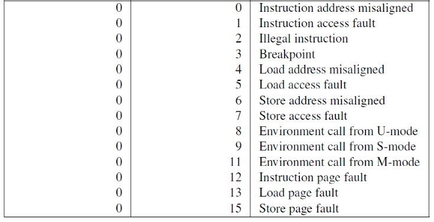

<!-- theme: gaia -->
<!-- _class: lead -->

## 第三讲 基于特权级的隔离与批处理操作系统
### 第二节 从 OS 角度看RISC-V

---
## 第二节 从 OS 角度看RISC-V
- 主流CPU指令集比较
- RISC-V 系统模式
- RISC-V 系统编程
  - U-Mode系统调用
  - RISC-V特权操作
  - 异常与中断机制
  - S-Mode虚拟内存机制
  - S-Mode异常与中断处理

---
## 主流CPU指令集比较

---
## 主流CPU指令集比较

---
## RISC-V 系统模式：概述

- RISC-V 系统模式即 RISC-V 的特权级模式
- 现代处理器一般具有多个特权级的模式
- 每一个特权级所能够执行的指令以及能够访问的处理器资源是不同的

---
## RISC-V 系统模式：概述

RISC-V 系统模式：内核态特权级
- 用户态专门用来执行应用程序
- 内核态专门用来执行操作系统
- 内核态的操作系统具有完全的硬件控制能力

---
## RISC-V 系统模式：概述

- 不同软件层有清晰的硬件隔离
- AEE：Application Execution Environment
- ABI：Application Bianry Interface
- MODE – U：User | S: Supervisor | H: Hypervisor | M: Machine

---
## RISC-V 系统模式：概述
| 序号  |  编码 | 含义  |
|--- | --- | --------------------- |
|  0 |  00 | User/Application & U  |
| 1 | 01 | Supervisor & S |
| 2 | 10 | Hypervisor & H |
| 3 | 11 | Machine & M |

- M, S, U 组合在一起的硬件系统适合运行类似UNIX的操作系统

---
## RISC-V 系统模式：控制状态寄存器

- 设置 CSR(控制状态寄存器) 实现隔离
  - 防止应用程序访问设备和敏感的 CPU 寄存器
  - 例如地址空间配置寄存器
- 强制隔离以避免对整个系统的可用性/可靠性/安全影响
  - 运行的程序通常是隔离的单元
  - 防止恶意程序、病毒、木马破坏或监视应用程序或干扰操作系统
    - 读/写内存: mstatus/satp CSR
    - 使用 100％的 CPU：mstatus/stvec CSR
    - mstatus/satp/stvec CSR 页表异常处理

---
## RISC-V 系统编程 ：简述
- 系统编程即据了解处理器的特权级架构，熟悉各个特权级能够访问的寄存器资源，内存资源，外设资源
- 编写内核级代码，构造操作系统，支持应用程序执行
  - 内存管理 进程调度
  - 异常处理 中断处理
  - 系统调用 外设控制
- 系统编程通常没有广泛用户编程库和方便的动态调试手段的支持
- 本课程的系统编程主要集中在 RISC-V 的 S-Mode 和 U-Mode

---
## RISC-V 系统编程：RISC-V 的系统调用
* U-Mode 下的应用程序不能够直接使用计算机的物理资源
* 环境调用异常：在执行 ecall 的时候发生，相当于系统调用
* 操作系统可以直接访问物理资源
* 如果应用程序需要使用硬件资源怎么办？
  * 在屏幕上打印”hello world”
  * 从文件中读入数据
* 通过系统调用从操作系统中获得服务
---
## RISC-V 系统编程 ：特权操作
- 特权操作：包括特权指令以及相应的指令码和操作数
- 指令码非常少：
  - mret 机器模式返回 
  - sret 监管者模式返回
  - wfi 等待中断 sfense.vma 虚拟地址屏障指令
- 很多功能通过控制状态寄存器（CSR：Control State Register）来实现

---
## RISC-V 系统编程 ：M-Mode
* M 模式是 RISC-V 中 hart（hardware thread）的最高权限模式
* M 模式下，hart 对计算机系统的底层功能有完全的使用权
* 标准 RISC-V 处理器都必须实现的权限模式
* M 模式最重要的特性是拦截和处理异常
  * 同步异常：执行期间产生，访问无效的寄存器地址，或执行无效操作码的指令
  * 异步异常：指令流异步的外部事件，中断，如时钟中断
* RISC-V 要求实现精确异常：保证异常之前的所有指令都完整执行，后续指令都没有开始执行

---
## RISC-V 系统编程：M-Mode：RISC-V 中断机制
- 中断是异步发生，是来自处理器外部的 I/O 设备的信号的结果。
- Timer 可以稳定定时地产生中断
  - 防止应用程序死占着 CPU 不放, 让 OS Kernel 能得到执行权...
  - 由高特权模式下的软件获得 CPU 控制权
  - 也可由高特权模式下的软件授权低特权模式软件处理中断

---
## RISC-V 系统编程：M-Mode：RISC-V 中断机制

---
## RISC-V 系统编程：RISC-V 的异常与中断
RISC-V 的异常: 通过 mcause 寄存器的不同位来表示

---
## RISC-V 系统编程：RISC-V 的异常与中断
RISC-V 的中断: 通过 mcause 寄存器的不同位来表示
- 软件中断：通过向内存映射寄存器写入数据来触发，一个 hart 中断另外一个hart（处理器间中断）
- 时钟中断：hart 的时间计数器寄存器 mtime 大于时间比较寄存器 mtimecmp
- 外部中断：由中断控制器触发，大部分情况下的外设都会连到这个中断控制器

---
## RISC-V 系统编程：RISC-V 的异常与中断

---
## RISC-V 系统编程：S-Mode: 虚拟内存机制
有虚拟内存的好处/坏处
- 灵活的不连续内存分配
- 多个运行程序的地址空间相互隔离/共享
- 隔离应用程序与OS 内核
- 多了访问页表的开销

---
## RISC-V 系统编程：思考题

- 如何通过断点异常来实现调试器的断点调试功能？
- 如何实现单步跟踪？

---
## RISC-V 系统编程：S 模式下的隔离
* S 模式比 U 模式权限更高，但是比 M 模式权限低
* S 模式下运行的软件不能使用 M 模式的 CSR 和指令，并受到 PMP 的限制
* 支持基于页面的虚拟内存

---
## RISC-V 系统编程：S 模式下的异常处理
* 默认情况下，所有的异常都使得控制权移交到 M 模式的异常处理程序
* M 模式的异常处理程序可以将异常重新导向 S 模式，但是这些额外的操作会减慢异常的处理速度
* RISC-V 提供一种异常委托机制，通过该机制可以选择性地将中断和同步异常交给 S 模式处理，而完全绕过 M 模式

---
## RISC-V 系统编程：异常委托寄存器
* mideleg (Machine Interrupt Delegation）CSR 控制将哪些中断委托给 S 模式处理
* 与 mip 和 mie 一样，mideleg 中的每个为对应一个异常
  * 如 mideleg[5] 对应于 S 模式的时钟中断，如果把它置位，S 模式的时钟中断将会移交 S 模式的异常处理器程序，而不是 M 模式的异常处理程序
  * 委托给 S 模式的任何中断都可以被 S 模式的软件屏蔽。sie(Supervisor Interrupt Enable) 和 sip（Supervisor Interrupt Pending）CSR 是 S 模式的控制状态寄存器，是 mie 和 mip 的子集。这两个寄存器和 M 模式下有相同的布局。sie 和 sip 中只有与由 mideleg 委托的中断对应的位才能读写，没有委派的中断对应位总是 0

---
## RISC-V 系统编程：异常委托寄存器

* M 模式还可以通过 medeleg CSR 将同步异常委托给 S 模式。
* 另外，发生异常时控制权都不会移交给权限更低的模式
  * 例如 medeleg[15] 会把 store page fault 委托给 S 模式
  * M 模式下发生的异常总是在 M 模式下处理
  * S 模式下发生的异常总是在 M 模式，或者在 S 模式下处理
  * 上述两种模式发生的异常不会由 U 模式处理 (除非有 U 模式中断处理机制)

---
## RISC-V 系统编程：S 模式的 CSR 寄存器
* S 模式有异常处理 CSR：sepc, stvec, scause, sscratch, stval 和 sstatus，与 M 模式的寄存器相对应
* sret 返回指令和 mret 指令也类似，但是它作用于 S 模式的异常处理 CSR

**sstatus 寄存器**

---
## RISC-V 系统编程：S 模式下的中断相关寄存器

S 模式中断寄存器。它们是宽为 XLEN 位的读/写寄存器，用于保存待处理的中断（sip）和中断使能位（sie）CSR。

**sie & sip 寄存器**

---
## RISC-V 系统编程：S 模式下的中断相关寄存器
异常向量（trap-vector）基地址寄存器（mtvec 和 stvec）CSR用于保存异常向量的配置，包括向量基址（BASE）和向量模式（MODE）。BASE 域中的值按 4 字节对齐。MODE = 0 表示所有异常都把 PC 设置为 BASE。MODE = 1 会在异步中断时将 PC 设置为 (base+(4 * cause))。

mtvec & stvec 寄存器

---
## RISC-V 系统编程：S 模式下的中断相关寄存器 

机器模式和监管模式 cause（mcause 和 scause）CSR。当处理发生异常时，CSR中被写入一个指示导致异常的事件的代码。如果异常由中断引起，则置上中断位。“异常代码”字段包含指示最后一个异常的代码。

mcause & scause 寄存器

---
## RISC-V 系统编程：S 模式的异常处理

**硬件执行内容**

hart 接受了异常，并需要委派给 S 模式，那么硬件会原子性的经历下面的状态转换

* 发生异常的指令 PC 被存入 sepc, 且 PC 被设置为 stvec
* scause 设置异常类型，stval 被设置为出错的地址或者异常相关信息
* 把 sstatus中的 SIE 置零，屏蔽中断， SIE 之前的值被保存在 SPIE 中
* 发生例外前的特权模式被保存在 sstatus 的 SPP 域，然后设置当前特权模式为S 模式

---
##  RISC-V 系统编程：S 模式的异常处理

相关指令
* ecall：触发中断，进入更高一层的中断处理流程之中。用户态进行系统调用进入内核态中断处理流程，内核态进行 SBI 调用进入机器态中断处理流程，使用的都是这条指令。
* sret：从内核态返回用户态，同时将 pc 的值设置为 sepc。（如果需要返回到
* sepc 后一条指令，就需要在 sret 之前修改 sepc 的值）
* ebreak：触发一个断点。
* mret：从机器态返回内核态，同时将 pc 的值设置为 mepc。

---
## RISC-V 系统编程：S 模式的异常处理
操作 CSR
* 只有一系列特殊的指令（CSR Instruction）可以读写 CSR。尽管所有模式都可以使用这些指令，用户态只能只读的访问某几个寄存器。
* 为了让操作 CSR 的指令不被干扰，许多 CSR 指令都是结合了读写的原子操作。

---
## RISC-V 系统编程：S 模式的异常处理
操作 CSR 

* csrrw dst, csr, src（CSR Read Write）：同时读写的原子操作，将指定 CSR 的值写入 dst，同时将 src 的值写入 CSR。
* csrr dst, csr（CSR Read）：读取一个 CSR 寄存器。
* csrw csr, src（CSR Write）：仅写入一个 CSR 寄存器。
* csrc(i) csr, rs1（CSR Clear）：将 CSR 寄存器中指定的位清零，csrc 使用通用寄存器作为 mask，csrci 则使用立即数。
* csrs(i) csr, rs1（CSR Set）：将 CSR 寄存器中指定的位置 1，csrc 使用通用寄存器作为 mask，csrci 则使用立即数。

---
## 小结

* 了解 RISC-V 的 M-Mode 和 S-Mode 的特征
* 了解系统软件在 M-Mode 和 S-Mode 下如何访问控制计算机系统
* 了解如何在 M-Mode<–>S-Mode<–>U-Mode 之间进行切换

