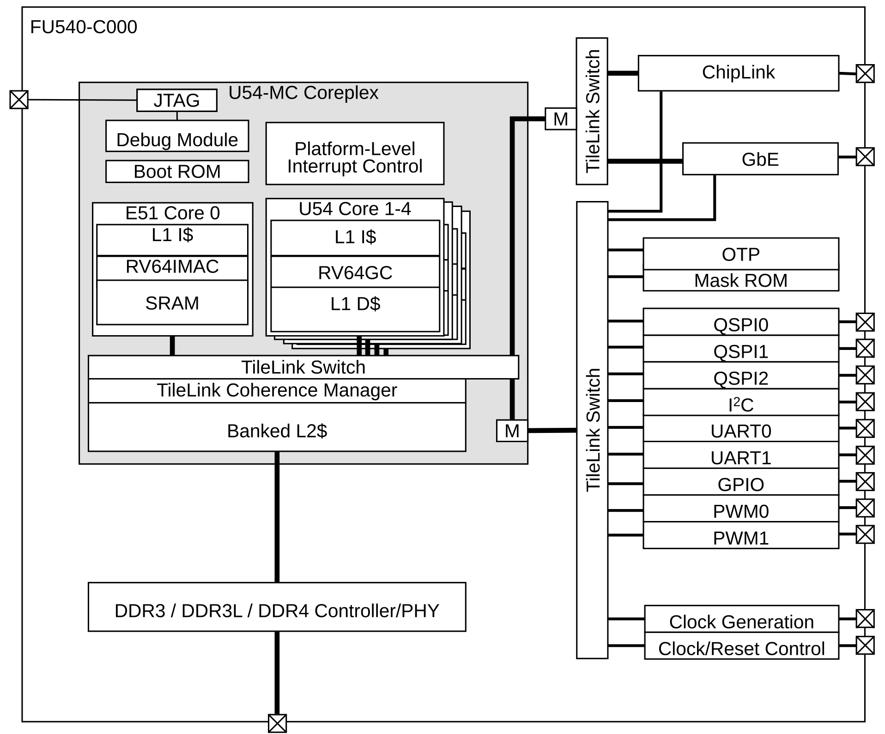

<!-- theme: gaia -->
<!-- _class: lead -->

## 第三讲 基于特权级的隔离与批处理操作系统
### 第二节 从 OS 角度看RISC-V

---
## 第二节 从 OS 角度看RISC-V
- 主流CPU比较
- RISC-V 系统模式
  - RISC-V的特权级和隔离机制 
- RISC-V 系统编程
  - U-Mode系统调用
  - RISC-V特权操作
  - 异常与中断机制
  - S-Mode虚拟内存机制
  - S-Mode异常与中断处理

---
## 主流CPU比较

---
## 主流CPU比较

---
## RISC-V 系统模式：概述

- RISC-V 系统模式即 RISC-V 的**特权级模式**
- 现代处理器一般具有多个特权级的模式
- 不同特权级能执行的指令和能访问的资源**不同**

---
## RISC-V 系统模式：概述

RISC-V 系统模式：内核态特权级
- 用户态专门用来执行应用程序
- 内核态专门用来执行操作系统
- 内核态的操作系统具有足够强大的硬件控制能力

---
## RISC-V 系统模式：概述

- 不同软件层有清晰的特权级硬件隔离支持
- AEE：Application Execution Environment
- ABI：Application Bianry Interface
- MODE – U：User | S: Supervisor | H: Hypervisor | M: Machine

---
## RISC-V 系统模式：概述
| 执行环境  |  编码 | 含义  |  跨越特权级 |
| --- | --- | --------------------- | --- |
|  APP |  00 | User/Application  | ``ecall`` |
| OS | 01 | Supervisor | ``ecall`` ``sret`` | 
| VMM | 10 | Hypervisor | --- |
| BIOS | 11 | Machine | ``ecall`` ``mret`` |

- M, S, U 组合在一起的硬件系统适合运行类似UNIX的操作系统

---
## RISC-V 系统模式：寄存器
寄存器分类
- 通用寄存器 x0-x31
  - 一般指令访问
- 控制状态寄存器(CSR)
  - 通过控制状态寄存器指令访问 

运行在用户态的应用程序不能访问CSR寄存器
运行在内核态的操作系统能访问CSR寄存器

---
## RISC-V 系统模式：控制状态寄存器
强制隔离以避免对整个系统的可用性/可靠性/安全影响
- 设置 CSR(控制状态寄存器) 实现隔离
  - 防止应用访问系统安全相关寄存器
    - 地址空间配置寄存器：mstatus/sstatus CSR
  - 防止应用长期使用 100％的 CPU
    - 中断配置寄存器：sstatus/stvec CSR
  - 防止应用破坏窃取数据
    - 地址空间相关寄存器：sstatus/satp/stvec CSR 

---
## RISC-V 系统模式：控制状态寄存器

- mtvec(MachineTrapVector)保存发生异常时需要跳转到的地址。
- mepc(Machine Exception PC)它指向发生异常的指令。
- mcause(Machine Exception Cause)它指示发生异常的种类。
- mie(Machine Interrupt Enable)它指出处理器目前能处理的中断。
- mip(Machine Interrupt Pending)它列出目前正准备处理的中断。
- mtval(Machine Trap Value)保存陷入(trap)附加信息:地址例外中出错的地址、发生非法指令例外的指令本身，对于其他异常，值为 0。
- mscratch(Machine Scratch)它暂时存放一个字大小的数据。
- mstatus(Machine Status)保存全局中断使能，以及其他的状态

---
## RISC-V 系统模式：控制状态寄存器

- sstatus(supervisor status)保存发生异常时需要跳转到的地址。
- stvec(supervisor trap vector)保存s模式的trap向量基址。stvec总是4字节对齐
- satp(supervisor Address Translation and Protection) S 模式控制状态寄存器控制了分页系统。
- sscratch (supervisor Scratch Register) 保存指向hart-local supervisor上下文的指针. 在trap处理程序的开头，sscratch与用户寄存器交换，以提供初始工作寄存器。
- sepc(supervisor Exception PC)它指向发生异常的指令。

---
## RISC-V 系统编程 ：简述
- 系统编程需要了解处理器的特权级架构，熟悉各个特权级能够访问的寄存器资源，内存资源，外设资源
- 编写内核级代码，构造操作系统，支持应用程序执行
  - 内存管理 进程调度
  - 异常处理 中断处理
  - 系统调用 外设控制
- 系统编程通常没有广泛用户编程库和方便的动态调试手段的支持
- 本课程的系统编程主要集中在 RISC-V 的 S-Mode 和 U-Mode

---
## RISC-V 系统编程：RISC-V 的系统调用
* U-Mode 下的应用程序不能够直接使用计算机的物理资源
* 环境调用异常：在执行 ``ecall`` 的时候发生，相当于系统调用
* 操作系统可以直接访问物理资源
* 如果应用程序需要使用硬件资源怎么办？
  * 在屏幕上打印”hello world”
  * 从文件中读入数据
* 通过系统调用从操作系统中获得服务
---
## RISC-V 系统编程 ：特权操作
- 特权操作：包括特权指令以及相应的指令码和操作数
- 指令码非常少：
  - ``mret`` 机器模式返回 
  - ``sret`` 监管者模式返回
  - ``wfi`` 等待中断 (wait for interupt)
  - ``sfense.vma`` 虚拟地址屏障指令
- 很多其他的系统功能通过控制状态寄存器来实现

---
## RISC-V 系统编程 ：M-Mode
* M 模式是 RISC-V 中 hart（hardware thread）的最高权限模式
* M 模式下，hart 对计算机系统的底层功能有完全的使用权
* 标准 RISC-V 处理器都必须实现的权限模式
* M 模式最重要的特性是拦截和处理异常
  * 同步异常：执行期间产生，访问无效的寄存器地址，或执行无效操作码的指令
  * 异步异常：指令流异步的外部事件，中断，如时钟中断
* RISC-V 要求实现精确异常：保证异常之前的所有指令都完整执行，后续指令都没有开始执行

---
## RISC-V 系统编程：M-Mode：RISC-V 中断机制
- 中断是异步发生，是来自处理器外部的 I/O 设备的信号的结果。
- Timer 可以稳定定时地产生中断
  - 防止应用程序死占着 CPU 不放, 让 OS Kernel 能得到执行权...
  - 由高特权模式下的软件获得 CPU 控制权
  - 也可由高特权模式下的软件授权低特权模式软件处理中断

---
## RISC-V 系统编程：M-Mode：RISC-V 中断机制

---
## RISC-V 系统编程：M-Mode：RISC-V 中断机制
- 异常指令的 PC 被保存在 mepc 中， PC 被设置为 mtvec。（对于同步异常， mepc指向导致异常的指令；对于中断，它指向中断处理后应该恢复执行的位置。）
- 根据异常来源设置 mcause，并将 mtval 设置为出错的地址或者其它适用于特定异常的信息字。
- 把控制状态寄存器 mstatus 中的 MIE 位置零以禁用中断，并把先前的 MIE 值保留到 MPIE 中。（SIE控制S模式下全局中断，MIE控制M模式下全局中断；SPIE记录的是SIE中断之前的值，MPIE记录的是MIE中断之前的值）
- 发生异常之前的权限模式保留在 mstatus 的 MPP 域中，再把权限模式更改为M。（MPP表示变化之前的特权级别是S、M or U模式）

---
## RISC-V 系统编程：RISC-V 的异常与中断
RISC-V 的异常: 通过 mcause 寄存器的不同位来表示

---
## RISC-V 系统编程：RISC-V 的异常与中断
RISC-V 的中断: 通过 mcause 寄存器的不同位来表示（mie）
- 软件中断：通过向内存映射寄存器写入数据来触发，一个 hart 中断另外一个hart（处理器间中断）
- 时钟中断：hart 的时间计数器寄存器 mtime 大于时间比较寄存器 mtimecmp
- 外部中断：由中断控制器触发，大部分情况下的外设都会连到这个中断控制器

---
## RISC-V 系统编程：RISC-V 的异常与中断

---
## RISC-V 系统编程：S-Mode: 虚存机制

- 通过stap CSR建立页表基址
- 建立OS和APP的页表
- 处理内存访问异常

---
## RISC-V 系统编程：思考题

- 如何通过断点异常来实现调试器的断点调试功能？
- 如何实现单步跟踪？

<!-- ---
## RISC-V 系统编程：S 模式下的隔离
* S 模式比 U 模式权限更高，但是比 M 模式权限低
* S 模式下运行的软件不能使用 M 模式的 CSR 和指令，并受到 PMP 的限制
* 支持基于页面的虚拟内存 -->

---
## RISC-V 系统编程：S 模式下的异常/中断处理
* 默认情况下，所有的异常/中断都使得控制权移交到 M 模式的异常/中断处理程序
* M 模式的异常/中断处理程序可以将异常/中断重新导向 S 模式，但是这些额外的操作会减慢异常/中断的处理速度
* RISC-V 提供一种异常/中断委托机制，通过该机制可以选择性地将异常/中断交给 S 模式处理，而完全绕过 M 模式

---
## RISC-V 系统编程：异常/中断委托寄存器
* mideleg/medeleg (Machine Interrupt/Exception Delegation）CSR 控制将哪些中断/异常委托给 S 模式处理
* mideleg/medeleg 中的每个为对应一个中断/异常
  * 如 mideleg[5] 对应于 S 模式的时钟中断，如果把它置位，S 模式的时钟中断将会移交 S 模式的异常/中断处理程序，而不是 M 模式的异常/中断处理程序
  * 委托给 S 模式的任何中断都可以被 S 模式的软件屏蔽。sie(Supervisor Interrupt Enable) 和 sip（Supervisor Interrupt Pending）CSR 是 S 模式的控制状态寄存器

---

## RISC-V 系统编程：异常/中断委托寄存器
* mideleg (Machine Interrupt Delegation）CSR 控制将哪些中断/异常委托给 S 模式处理
* mideleg 中的每个为对应一个中断/异常
  * mideleg[1]用于控制是否将核间中断交给s模式处理
  * mideleg[5]用于控制是否将定时中断交给s模式处理
  * mideleg[9]用于控制是否将外部中断交给s模式处理

---

## RISC-V 系统编程：异常/中断委托寄存器
* medeleg (Machine Exception Delegation）CSR 控制将哪些中断/异常委托给 S 模式处理
* medeleg 中的每个为对应一个中断/异常
  * medeleg[1]用于控制是否将指令获取错误异常交给s模式处理
  * medeleg[12]用于控制是否将指令页异常交给s模式处理
  * medeleg[9]用于控制是否将数据页异常交给s模式处理

<!-- ，是 mie 和 mip 的子集。这两个寄存器和 M 模式下有相同的布局。sie 和 sip 中只有与由 mideleg 委托的中断对应的位才能读写，没有委派的中断对应位总是 0 -->

---
## RISC-V 系统编程：异常/中断委托寄存器

* 另外，发生异常时控制权都不会移交给权限更低的模式
  * 例如 medeleg[15] 会把 store page fault 委托给 S 模式
  * M 模式下发生的异常总是在 M 模式下处理
  * S 模式下发生的异常总是在 M 模式，或者在 S 模式下处理
  * 上述两种模式发生的异常不会由 U 模式处理 (除非有 U 模式中断处理机制)

---
## RISC-V 系统编程：异常/中断 CSR 寄存器
* S 模式有异常/中断 CSR：sepc, stvec, scause, sscratch, stval 和 sstatus，与 M 模式的寄存器相对应
* sret 返回指令和 mret 指令也类似，但是它作用于 S 模式的异常处理 CSR

**sstatus 寄存器**

---
## RISC-V 系统编程：异常/中断 CSR 寄存器

S 模式中断寄存器。它们是宽为 XLEN 位的读/写寄存器，用于保存待处理的中断（sip）和中断使能位（sie）CSR。

**sie & sip 寄存器**
- sie （supervisor interrupt-enabled register）
- sip（supervisor interrupt pending）

---
## RISC-V 系统编程：异常/中断 CSR 寄存器
异常/中断向量（trap-vector）基地址寄存器（mtvec 和 stvec）CSR用于保存异常/中断向量的配置，包括向量基址（BASE）和向量模式（MODE）。BASE 域中的值按 4 字节对齐。MODE = 0 表示所有异常/中断都把 PC 设置为 BASE。MODE = 1 会在异步中断时将 PC 设置为 (base+(4 * cause))。

mtvec & stvec 寄存器

---
## RISC-V 系统编程：异常/中断 CSR 寄存器 

机器模式和监管模式 cause（mcause 和 scause）CSR。当发生异常时，CSR中被写入一个指示导致异常的事件的代码。如果事件由中断引起，则置上中断位。“异常代码”字段包含指示最后一个异常的代码。

mcause & scause 寄存器

---
## RISC-V 系统编程：S 模式的异常/中断处理

**硬件执行内容**

hart 接受了异常/中断，并需要委派给 S 模式，那么硬件会原子性的经历下面的状态转换

* 发生异常/中断的指令 PC 被存入 sepc, 且 PC 被设置为 stvec
* scause 设置异常/中断类型，stval被设置为出错的地址/异常相关信息
* 把 sstatus中的 SIE 位置零，屏蔽中断， SIE 位之前的值被保存在 SPIE 位中
* 发生例外前的特权模式被保存在 sstatus 的 SPP 域，然后设置当前特权模式为S 模式

---
##  RISC-V 系统编程：S 模式的异常/中断处理

相关指令:
* ``ecall``：触发异常，进入更高特级级的异常/中断处理流程。
* ``sret``：从内核态返回用户态。
  -  执行``sret``之前将返回地址设置为 sepc或sepc的后一条指令。
* ``ebreak``：触发一个断点，进入更高特级级的异常/中断处理流程。
* ``mret``：从机器态返回内核态，同时将 pc 的值设置为 mepc。
  - 执行``mret``之前将返回地址设置为 mepc或mepc的后一条指令。

<!-- 用户态进行系统调用进入内核态中断处理流程，内核态进行 SBI 调用进入机器态中断处理流程，使用的都是ecall这条指令。 -->

---
## RISC-V 系统编程：S 模式的异常处理
操作 CSR
* 有几个特殊指令（CSR Instruction）可以读写 CSR。尽管所有模式都可以使用这些指令，用户态只能只读的访问某几个寄存器。
* 为了让操作 CSR 的指令不被干扰，许多 CSR 指令都是结合了读写的原子操作。

---
## RISC-V 系统编程：S 模式的异常处理
操作 CSR 

* ``csrrw dst, csr, src``（CSR Read Write）：同时读写的原子操作，将指定 CSR 的值写入 dst，同时将 src 的值写入 CSR。
* ``csrr dst, csr``（CSR Read）：读取一个 CSR 寄存器。
* ``csrw csr, src``（CSR Write）：仅写入一个 CSR 寄存器。
* ``csrc(i) csr, rs1``（CSR Clear）：将 CSR 寄存器中指定的位清零，csrc 使用通用寄存器作为 mask，csrci 则使用立即数。
* ``csrs(i) csr, rs1``（CSR Set）：将 CSR 寄存器中指定的位置 1，csrc 使用通用寄存器作为 mask，csrci 则使用立即数。

---
## 小结

* 了解 RISC-V 特权级
* 了解 RISC-V 的 M-Mode 和 S-Mode 的特征
* 了解系统软件在 M-Mode 和 S-Mode 下如何访问控制计算机系统
* 了解如何在 M-Mode<–>S-Mode<–>U-Mode 之间进行切换

