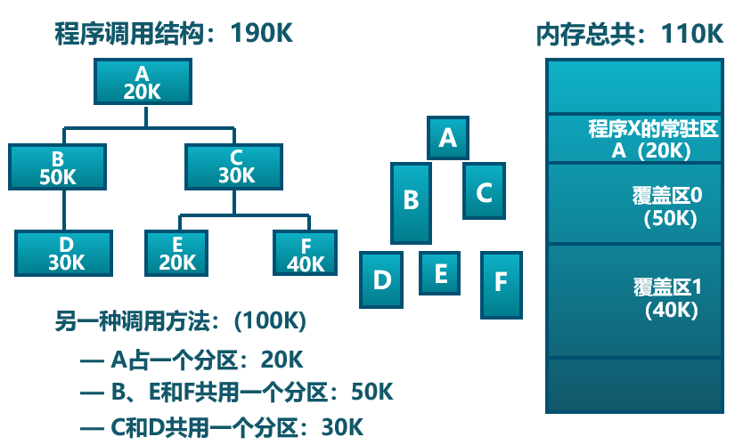
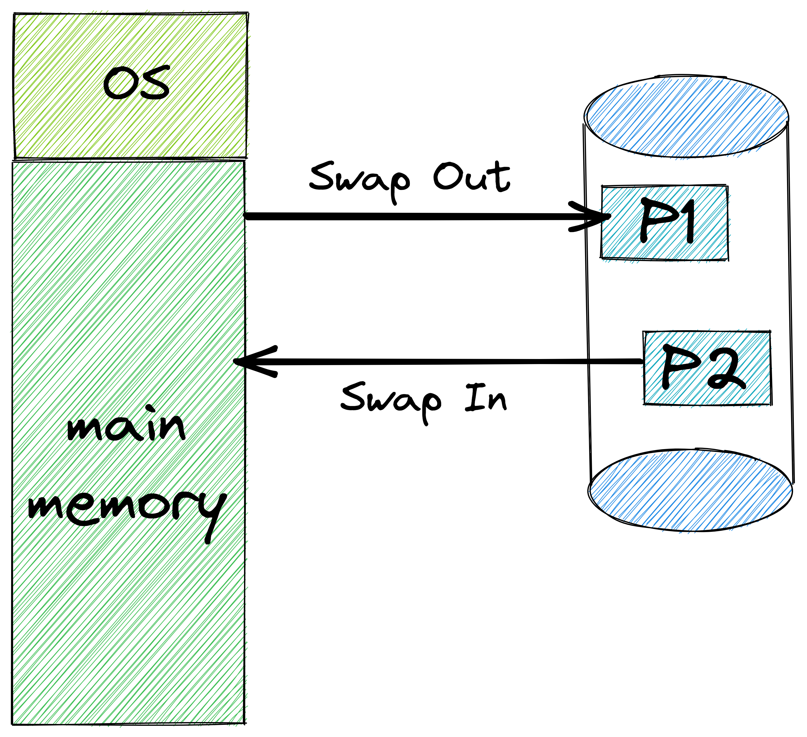

<!-- theme: gaia -->
<!-- _class: lead -->

## 第六讲 地址空间-虚拟存储管理

### 第一节 虚拟存储的基本概念

 
 

向勇 陈渝 李国良 

 
 

2022年春季

---
### 第一节 虚拟存储的基本概念
- 需求背景
- 覆盖技术
- 交换技术
- 局部性原理
- 虚拟存储定义
- 虚拟页式存储
- 缺页异常

---
### 虚拟存储的基本概念 -- 需求背景

程序规模的增长速度远远大于存储器容量的增长速度

理想中的存储器: 容量更大、速度更快、价格更便宜的非易失性存储器  

---
### 虚拟存储的基本概念 -- 需求背景
**主要问题**：计算机系统时常出现**内存不够用**
**基本思路**：内存不够，外存来补
- 函数覆盖（overlay）
  - 应用程序以**函数/模块为单位手动**换入换出内存
- 程序交换（swapping）
  - 操作系统以**程序为单位自动**换入换出内存
- 虚拟存储(virtual storage)
  - 操作系统以**页为单位自动**换入换出内存

虚拟存储=内存+外存

---
### 虚拟存储的基本概念 -- 需求背景
计算机系统时常出现内存空间不够用
- 模块覆盖（overlay）
  - 应用程序**手动**把需要的指令和数据保存在内存中
- 任务交换（swapping）
  - 操作系统**自动**把暂时不能执行的程序保存到外存中
- 虚拟存储
  - 在有限容量的内存中，以**页为单位自动**装入更多更大的程序
- 操作系统对虚拟存储的抽象：地址空间

---
### 虚拟存储的基本概念 -- 覆盖技术
- 目标
  - 程序员手动控制在较小的可用内存中运行较大的程序
- 基本思路
  - 不会在一个时间段内执行的函数或模块可以共享一块有限的空间

---
### 虚拟存储的基本概念 -- 覆盖技术
  - 在时间段内，函数或模块不会在程序执行的一条控制流上
  - 覆盖：把一个程序划分为一系列功能相对独立的程序段，让执行时不要求同时装入内存的程序段组成一组（称为覆盖段），共享主存的同一个区域，这种内存扩充技术就是覆盖。

    - 必要部分（常用）的代码和数据常驻内存
    - 可选部分（不常用）放在其他程序模块中,只在需要用到时装入内存
    - 不存在调用关系的模块可相互覆盖，共用同一块内存区域

---
### 虚拟存储的基本概念 -- 覆盖技术

 

---
### 虚拟存储的基本概念 -- 覆盖技术  
覆盖技术的不足

- 增加编程困难
  - 需程序员划分功能模块，并确定模块间的覆盖关系
  - 增加了编程的复杂度；
- 增加执行时间
  - 从外存装入覆盖模块
  - 时间换空间

 Turbo Pascal的Overlay系统单元支持程序员控制的覆盖技术

---
### 虚拟存储的基本概念 -- 交换技术 
- 基本思路
  - 操作系统以**程序为单位自动**换入换出内存
- 方法
  - 换出(swap out):把一个执行程序的整个地址空间内容保存到外存
  - 换入(swap in):将外存中某执行程序的地址空间内容读入到内存

---
### 虚拟存储的基本概念 -- 交换技术 
面临的问题
- 交换时机：何时需要发生交换？
  - 只当内存空间不够或有不够的可能时换出
- 交换区大小:存放所有用户进程的所有内存映像的拷贝
- 程序换入时的重定位：换出后再换入时要放在原处吗？
  - 不一定在原处，需要某种机制保证程序正确寻址&执行 

---
### 虚拟存储的基本概念 -- 覆盖与交换的比较
- 程序覆盖
  - 发生在某时间段不在一个控制流上的模块/函数间
  - 以模块/函数为单位
  - 程序员须给出模块/函数间的逻辑覆盖结构
- 交换
  - 发生在运行的程序之间
  - 以运行的程序为单位
  - 不需要模块间的逻辑覆盖结构

运行的程序：``任务``（也指以后进一步进化的``进程``）
 
 ---
### 虚拟存储的基本概念 -- 定义
- 定义：虚拟存储=内存+外存
- 思路：操作系统将不常用的部分内存暂存到外存，将要处理器访问的数据从外存装入内存

 ---
### 虚拟存储的基本概念 -- 局部性
局部性（locality）：程序在执行过程中的一个较短时期，所执行的指令地址和指令的操作数地址，分别局限于一定区域
- 时间局部性：一条指令的一次执行和下次执行，一个数据的一次访问和下次访问都集中在一个较短时期内
- 空间局部性：当前指令和邻近的几条指令，当前访问的数据和邻近的几个数据都集中在一个较小区域内
- 分支局部性：一条跳转指令的两次执行，很可能跳到相同的内存位置

局部性的意义：如果大部分程序运行具有局部性特征，虚拟存储技术是能够实现的，而且可取得满意的效果
 

---
### 虚拟存储的基本概念 -- 思路与规则
- 思路：将不常用的部分内存块暂存到外存
- 规则：
  - 装载程序时：只将当前指令执行需要的部分页面或段装入内存
  - 指令执行中需要的指令或数据不在内存（称为缺页或缺段）时：处理器通知操作系统将相应的页面或段调入内存
  - 操作系统将内存中暂时不用的页面或段保存到外存
- 实现方式：
  - 虚拟页式存储
  - 虚拟段式存储

---
### 虚拟存储的基本概念 -- 基本特征
- 不连续性
  - 物理内存分配非连续
  - 虚拟地址空间使用非连续
- 大用户空间
  - 提供给用户的虚拟内存可大于实际的物理内存
- 部分交换
  - 虚拟存储只对部分虚拟地址空间进行调入和调出
 

---
### 虚拟存储的基本概念 -- 底层支撑
- 硬件(MMU/TLB/PageTable)
  - 页式或段式存储中的硬件地址转换机制、硬件异常
- 软件(OS)
  - 内存中建立页表或段表
  - 管理内存和外存间页面或段的换入和换出
 

---
### 虚拟存储的基本概念 -- 虚拟页式存储管理
- 在页式存储管理的基础上，增加请求调页和页面置换
基本思路：
- 当用户程序要装载到内存运行时，只装入部分页面，就启动程序运行
- 用户程序在运行中发现有需要的代码或数据不在内存时，则向系统发出缺页异常请求
- 操作系统在处理缺页异常时，将外存中相应的页面调入内存，使得用户程序能继续运行
- 当内存快用完时，操作系统把部分页从内存调出到外出

---
虚拟页式存储管理即
-- 在页式存储管理的基础上，增加请求调页和页面置换
 

---
### 虚拟存储的基本概念 -- 缺页异常的处理流程
1. CPU读内存单元，在TLB中根据其虚拟地址匹配物理地址，未命中，读页表；
1. 由于页表项的存在位为0，CPU产生Page Fault 异常；
1. OS处理此异常，查找到保存在外存中对应的应用的页面内容；

---
### 虚拟存储的基本概念 -- 缺页异常的处理流程

4-1. 如有空闲物理页帧，把外存中的页面内容换入到某空闲物理页帧中；
4-2 . 如无空闲物理页帧，通过置换算法释放/换出某物理页帧到外存，再把外存中的页面内容换入到某空闲物理页帧中；

---
### 虚拟存储的基本概念 -- 缺页异常的处理流程

5. 修改页表项，建立虚拟页到物理页帧的映射，存在位置1；
6. OS返回到应用程序，让处理器重新执行产生Page Fault 异常的读内存单元指令。

---
### 虚拟存储的基本概念 -- 外存管理
- 在何处保存未被映射的页？
  - 应能方便地找到在外存中的页面内容
  - 交换空间（磁盘或者文件）
    - 采用特殊格式存储未被映射的页面
  
  
---
### 虚拟存储的基本概念 -- 外存管理
- 在何处保存放在外存中的页的地址？
  - 在存在位为0的页表项中保存外存的页地址
  - 磁盘：一般是扇区地址

---
### 虚拟存储的基本概念 -- 外存管理

- 虚拟页式存储中的外存选择
  - 代码段：可执行二进制文件
  - 动态加载的共享库程序段：动态调用的库文件
  - 动态加载的共享库程序段：动态调用的库文件
  - 其它段：交换空间

---
### 虚拟存储的基本概念 -- 性能
有效存储访问时间（effective memory access time EAT）

EAT = 访存时间 * (1-p)
        + 缺页异常处理时间 * 缺页率p

例子
- 访存时间: 10 ns
- 磁盘访问时间: 5 ms
- 缺页率p
- EAT = 10(1–p) + 5,000,000p(1+q) 

