<!-- theme: gaia -->
<!-- _class: lead -->

## 第六讲 地址空间-虚拟存储管理

### 第二节 页面置换算法
- **基本概念**
- 局部页面置换算法
- 全局页面置换算法

--- 
### 基本概念 -- 功能与设计目标
- 功能
  - 当出现缺页异常，需调入新页面而内存已满时，置换算法选择被置换的物理页面

- 设计目标
  - 尽可能减少页面的调入调出次数
  - 把未来不再访问或短期内不访问的页面调出


--- 
### 基本概念 -- 功能与设计目标
- 页面锁定(frame locking)
  - 描述必须常驻内存的逻辑页面
  - 操作系统的关键部分
  - 要求响应速度的代码和数据
  - 页表中的锁定标志位(lock bit)


--- 
### 基本概念 -- 评价方法
- 评价方法
  - 模拟页面置换行为，记录缺页次数；更少的缺页, 更好的性能
  - 记录程序运行中访问内存的页面轨迹
- 举例: 虚拟地址访问用(页号, 位移)表示
```
(3,0),  (1,9),  (4,1),  (2,1),  (5,3),  (2,0),  (1,9),  (2,4),  (3,1),  (4,8)
```
- 对应的页面轨迹
```
3, 1, 4, 2, 5, 2, 1, 2, 3, 4 用数字表示 
c, a, d, b, e, b, a, b, c, d 用字符表示
```


--- 
### 基本概念 -- 分类
- 局部页面置换算法
  - 置换页面的选择范围仅限于当前进程占用的物理页面内
  - 最优算法、先进先出算法、最近最久未使用算法
  - 时钟算法、最不常用算法

- 全局页面置换算法
  - 置换页面的选择范围是所有可换出的物理页面
  - 工作集算法、缺页率算法

---
### 第二节 页面置换算法
- 基本概念
- **局部页面置换算法**
- 全局页面置换算法
  
---
### 第二节 页面置换算法 -- 局部页面置换算法
- 最优页面置换算法 (OPT, optimal)
- 先进先出算法 (FIFO)
- 最近最久未使用算法 (LRU, Least Recently Used)
- 时钟页面置换算法 (Clock)
- 最不常用算法 (LFU, Least Frequently Used)
- Belady现象
- LRU、FIFO和Clock的比较


  
---
### 最优页面置换算法 (OPT, optimal)
- 基本思路
  - 置换在未来最长时间不访问的页面
- 算法实现
  - 缺页时，计算内存中每个逻辑页面的下一次访问时间
  - 选择未来最长时间不访问的页面
  
---
### 最优页面置换算法 (OPT, optimal)
- 算法特征
  - 缺页最少，是理想情况
  - 实际系统中无法实现
  - 无法预知每个页面在下次访问前的等待时间
    - 在模拟器上运行某个程序，并记录每一次的页面访问情况
    - 第二遍运行时使用最优算法
 
  
---
### 最优页面置换算法 (OPT, optimal) -- 示例

  
  
---
### 最优页面置换算法 (OPT, optimal) -- 示例


  
---
### 最优页面置换算法 (OPT, optimal) -- 示例
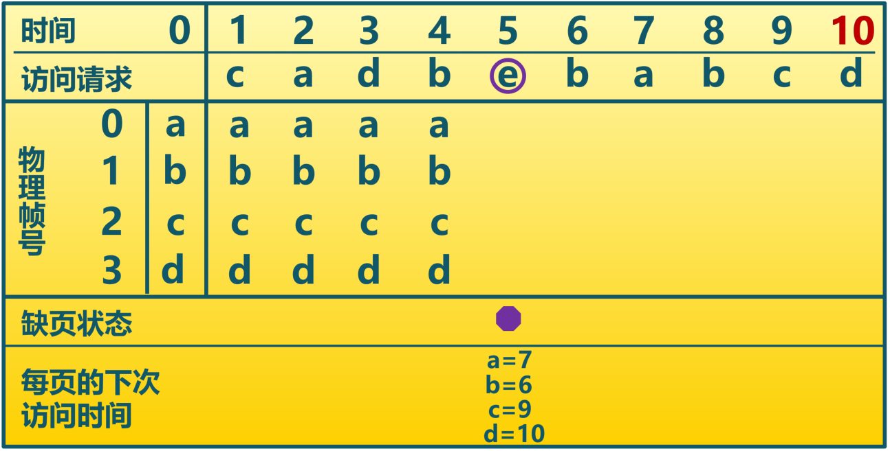 

  
---
### 最优页面置换算法 (OPT, optimal) -- 示例
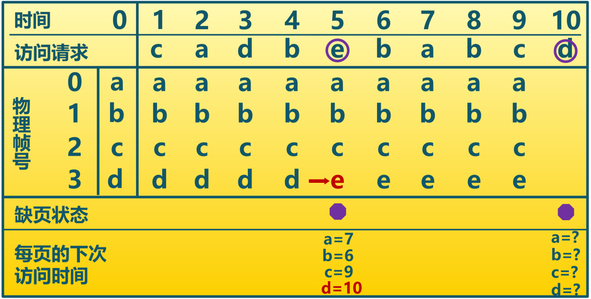


  
---
### 先进先出算法 (FIFO)
- 基本思路
  - 选择在内存驻留时间最长的页面进行置换
- 算法实现
  - 维护一个记录所有位于内存中的逻辑页面链表
  - 链表元素按驻留内存的时间排序，链首最长，链尾最短
  - 出现缺页时，选择链首页面进行置换，新页面加到链尾

  
---
### 先进先出算法 (FIFO)
- 算法特征  
  - 实现简单
  - 性能较差，调出的页面可能是经常访问的
  - 分配物理页面数增加时，缺页并不一定减少(Belady现象)
  - 很少单独使用

  
---
### 先进先出算法 (FIFO) -- 示例


  
---
### 先进先出算法 (FIFO) -- 示例


  
---
### 先进先出算法 (FIFO) -- 示例


  
---
### 先进先出算法 (FIFO) -- 示例


  
---
### 先进先出算法 (FIFO) -- 示例


  
---
### 先进先出算法 (FIFO) -- 示例


  
---
### 最近最久未使用算法 (Least Recently Used, LRU)
- 基本思路
  - 选择最长时间没有被引用的页面进行置换
  - 如某些页面长时间未被访问，则它们在将来还可能会长时间不会访问

- 算法实现
  - 缺页时，计算内存中每个逻辑页面的上一次访问时间
  - 缺页时，计算内存中每个逻辑页面的上一次访问时间
- 算法特征
  - 最优置换算法的一种近似


  
---
### 最近最久未使用算法 (LRU) -- 示例


  
---
### 最近最久未使用算法 (LRU) -- 示例


  
---
### 最近最久未使用算法 (LRU) -- 示例
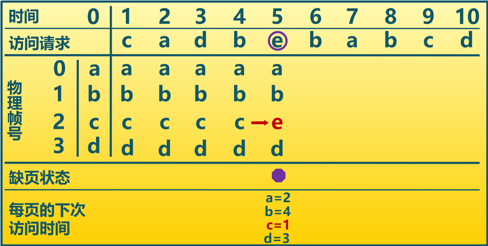

  
---
### 最近最久未使用算法 (LRU) -- 示例


  
---
### 最近最久未使用算法 (LRU) -- 示例


  
---
### 最近最久未使用算法 (LRU) -- 示例
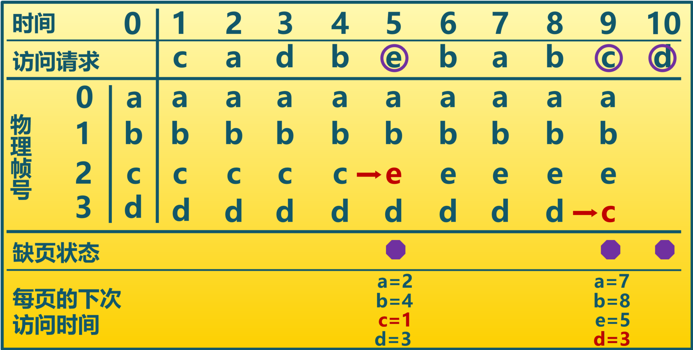


  
---
### 最近最久未使用算法 (LRU) -- 示例
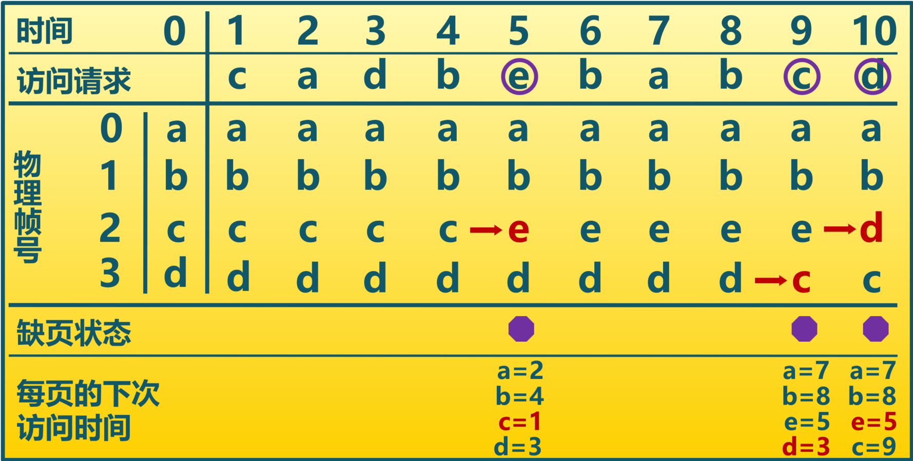

  
  
---
### 最近最久未使用算法 (LRU) -- 可能实现方法
- 页面链表
  - 系统维护一个按最近一次访问时间排序的页面链表
    - 链表首节点是最近刚刚使用过的页面
    - 链表尾节点是最久未使用的页面
  - 访问内存时，找到相应页面，并把它移到链表之首
  - 缺页时，置换链表尾节点的页面
- 特征
  - 开销大

  
  
---
### 最近最久未使用算法 (LRU) -- 可能实现方法

- 活动页面栈
  - 访问页面时，将此页号压入栈顶，并栈内相同的页号抽出
  - 缺页时，置换栈底的页面
- 特征
  - 开销大

  
---
### 最近最久未使用算法 (LRU) -- 用栈实现示例
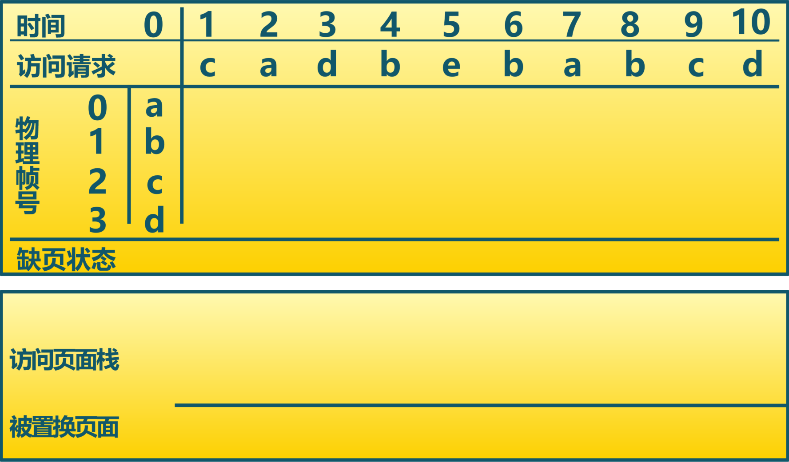

   
---
### 最近最久未使用算法 (LRU) -- 用栈实现示例


  
---
### 最近最久未使用算法 (LRU) -- 用栈实现示例


  
---
### 最近最久未使用算法 (LRU) -- 用栈实现示例


---
### 最近最久未使用算法 (LRU) -- 用栈实现示例


  
---
### 最近最久未使用算法 (LRU) -- 用栈实现示例


  
---
### 最近最久未使用算法 (LRU) -- 用栈实现示例


  
---
### 最近最久未使用算法 (LRU) -- 用栈实现示例
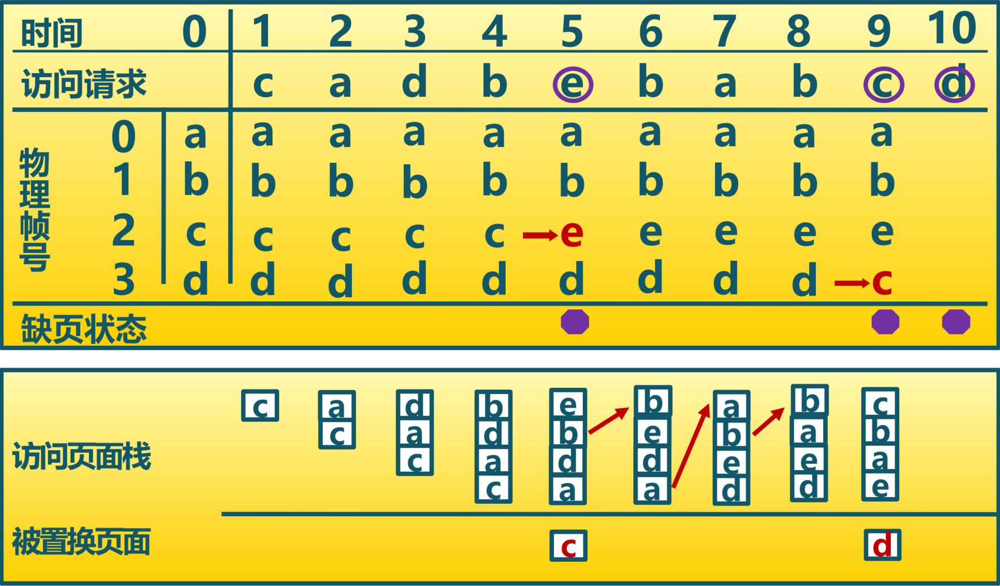

  
---
### 最近最久未使用算法 (LRU) -- 用栈实现示例


  
---
### 时钟置换算法（Clock）
- 基本思路
  - 仅对页面的访问情况进行大致统计
- 数据结构 
  - 在页表项中增加访问位，描述页面在过去一段时间的内访问情况
  - 各页面组织成环形链表
  - 指针指向最先调入的页面

  
---
### 时钟置换算法（Clock）
- 算法实现
  - 访问页面时，在页表项记录页面访问情况
  - 缺页时，从指针处开始顺序查找未被访问的页面进行置换

- 算法特征
  - 时钟算法是LRU和FIFO的折中

  
---
### 时钟置换算法（Clock）
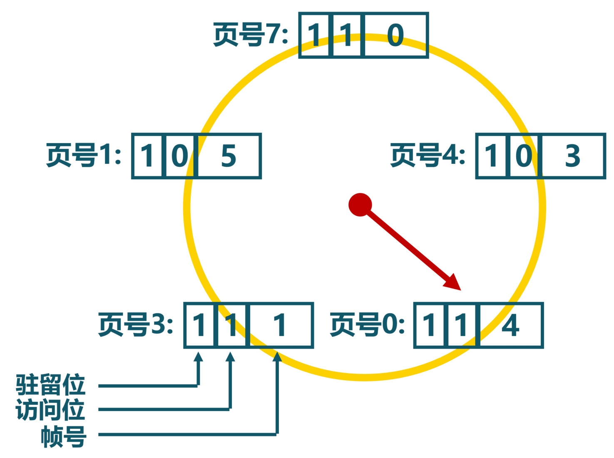
  
---
### 时钟置换算法（Clock）
- 具体实现过程
  - 页面装入内存时，访问位初始化为0
  - 访问页面（读/写)时，访问位置1
  - 缺页时，从指针当前位置顺序检查环形链表
    - 访问位为0，则置换该页
    - 访问位为1，则访问位置0，并指针移动到下一个页面，直到找到可置换的页面

---
### 时钟置换算法（Clock）-- 示例


---
### 时钟置换算法（Clock）-- 示例
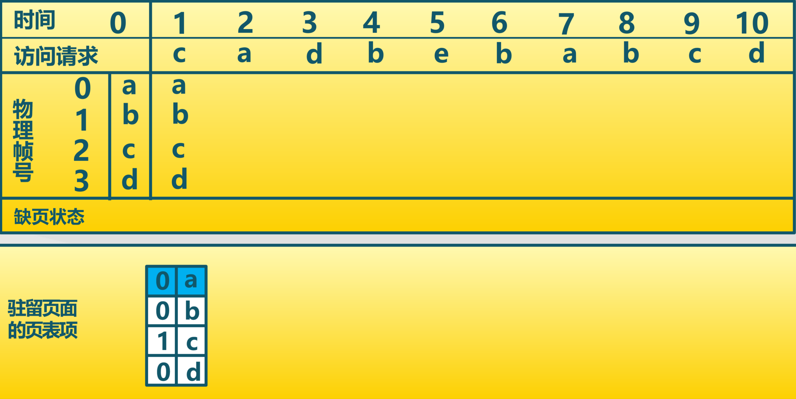


---
### 时钟置换算法（Clock）-- 示例
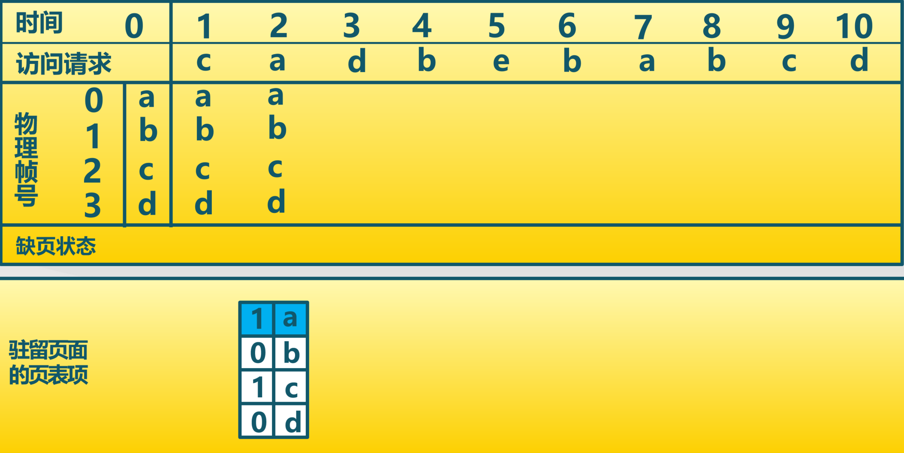


---
### 时钟置换算法（Clock）-- 示例


---
### 时钟置换算法（Clock）-- 示例


---
### 时钟置换算法（Clock）-- 示例


---
### 时钟置换算法（Clock）-- 示例
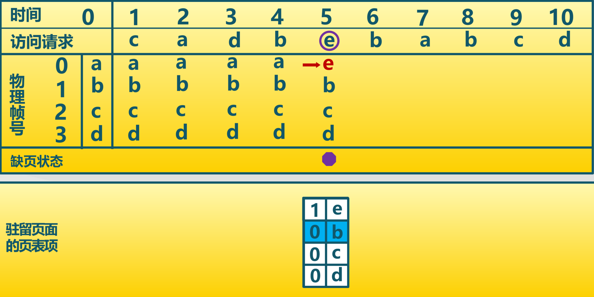


---
### 时钟置换算法（Clock）-- 示例
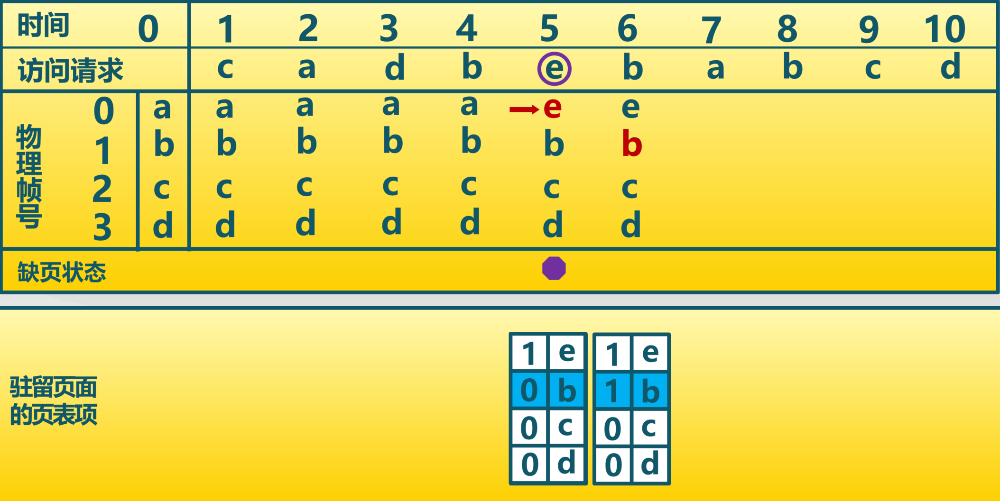


---
### 时钟置换算法（Clock）-- 示例


---
### 时钟置换算法（Clock）-- 示例


---
### 时钟置换算法（Clock）-- 示例


---
### 时钟置换算法（Clock）-- 示例


---
### 时钟置换算法（Clock）-- 示例
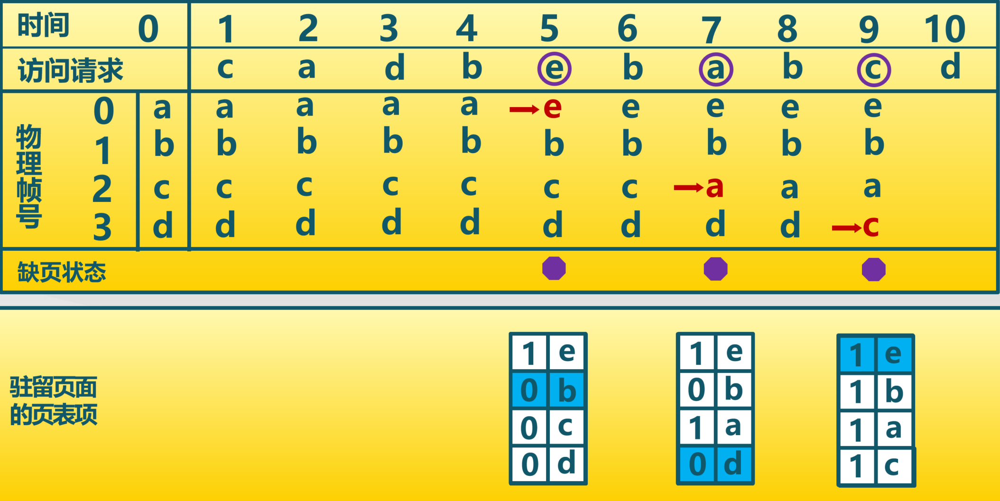


---
### 时钟置换算法（Clock）-- 示例


---
### 时钟置换算法（Clock）-- 示例
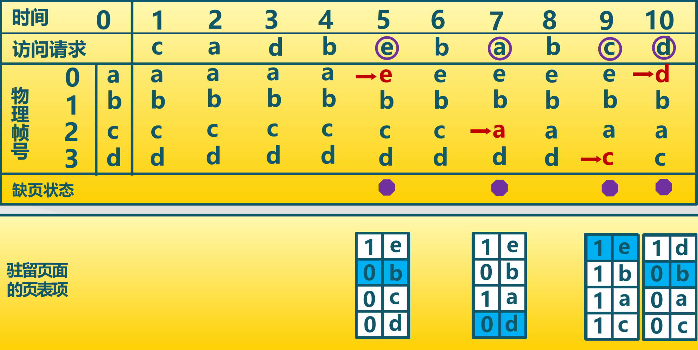


  
---
### 改进的时钟置换算法
- 基本思路
  - 减少修改页的缺页处理开销
- 数据结构 
  - 在页面中增加修改位，描述页面在过去一段时间的内写访问情况
- 算法实现
  - 访问页面时，在页表项记录页面访问情况
  - 修改页面时，在页表项记录页面修改情况
  - 缺页时，修改页面标志位，以跳过有修改的页面
  
---
### 改进的时钟置换算法


  
---
### 改进的时钟置换算法 -- 示例


  
---
### 改进的时钟置换算法 -- 示例


  
---
### 改进的时钟置换算法 -- 示例


  
---
### 改进的时钟置换算法 -- 示例


---
### 改进的时钟置换算法 -- 示例


  
---
### 改进的时钟置换算法 -- 示例


  
---
### 改进的时钟置换算法 -- 示例
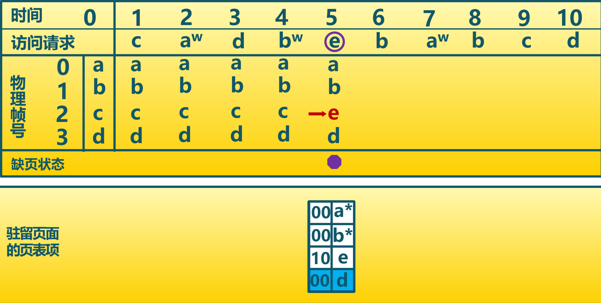

  
---
### 改进的时钟置换算法 -- 示例


---
### 改进的时钟置换算法 -- 示例
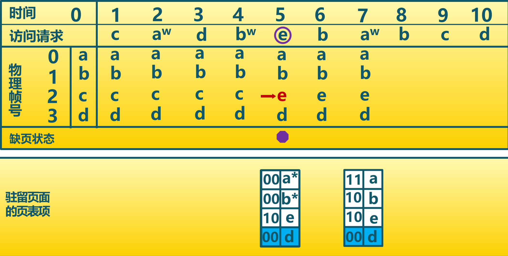

  
---
### 改进的时钟置换算法 -- 示例


  
---
### 改进的时钟置换算法 -- 示例


  
---
### 改进的时钟置换算法 -- 示例


---
### 改进的时钟置换算法 -- 示例


  
---
### 改进的时钟置换算法 -- 示例
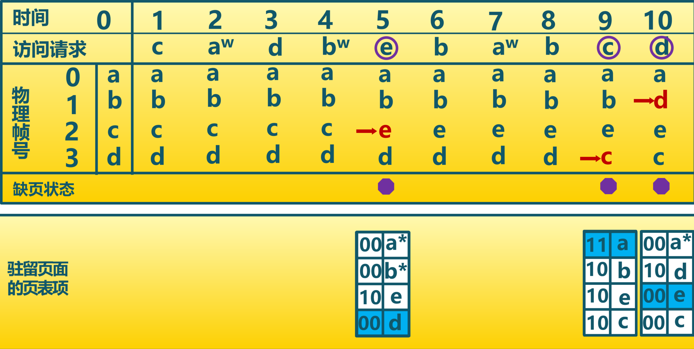

  
---
### 最不常用算法（Least Frequently Used, LFU）

- 基本思路
  - 缺页时，置换访问次数最少的页面

- 算法实现
  - 每个页面设置一个访问计数
  - 访问页面时，访问计数加1 
  - 缺页时，置换计数最小的页面

  
---
### 最不常用算法（Least Frequently Used, LFU）  

- 特征
  - 算法开销大
  - 开始时频繁使用，但以后不使用的页面很难置换
    - 解决方法：计数定期右移

- LRU关注多久未访问,时间越短越好
- LFU关注访问次数，次数越多越好

  
---
### 最不常用算法（LFU）
4个物理页帧，最初的访问次数a-＞8 b-＞5 c-＞6 d-＞2
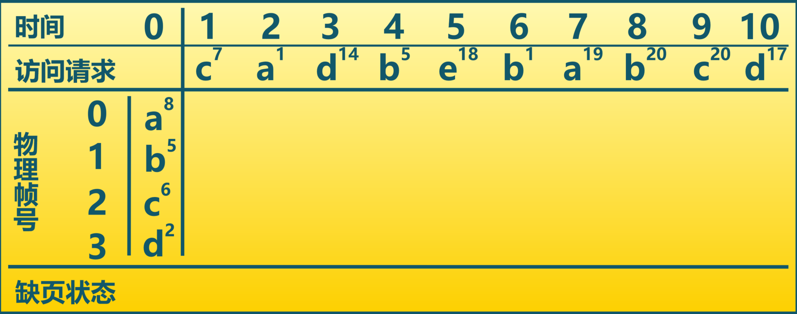

  
---
### 最不常用算法（LFU）
4个物理页帧，最初的访问次数a-＞8 b-＞5 c-＞6 d-＞2


  
---
### 最不常用算法（LFU）
4个物理页帧，最初的访问次数a-＞8 b-＞5 c-＞6 d-＞2


  
---
### 最不常用算法（LFU）
4个物理页帧，最初的访问次数a-＞8 b-＞5 c-＞6 d-＞2
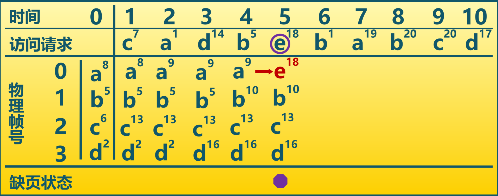

---
### 最不常用算法（LFU）
4个物理页帧，最初的访问次数a-＞8 b-＞5 c-＞6 d-＞2


  
---
### 最不常用算法（LFU）
4个物理页帧，最初的访问次数a-＞8 b-＞5 c-＞6 d-＞2


  
---
### 最不常用算法（LFU）
4个物理页帧，最初的访问次数a-＞8 b-＞5 c-＞6 d-＞2
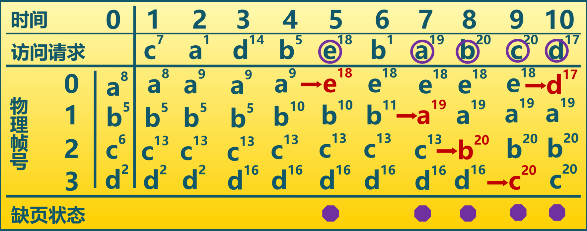

---
### Belady现象
- 现象
  - 采用FIFO等算法时，可能出现分配的物理页面数增加，缺页次数反而升高的异常现象
- 原因
  - FIFO算法的置换特征与进程访问内存的动态特征矛盾
  - 被它置换出去的页面并不一定是进程近期不会访问的
- 思考
  - 哪些置换算法没有Belady现象？

---
### Belady现象 -- FIFO算法   
访问顺序 : 1, 2, 3, 4, 1, 2, 5, 1, 2, 3, 4, 5
物理页面数: 3  ； 缺页次数: 9


---
### Belady现象 -- FIFO算法   
访问顺序 : 1, 2, 3, 4, 1, 2, 5, 1, 2, 3, 4, 5
物理页面数: 3  ； 缺页次数: 9


---
### Belady现象 -- FIFO算法   
访问顺序 : 1, 2, 3, 4, 1, 2, 5, 1, 2, 3, 4, 5
物理页面数: 3  ； 缺页次数: 9


---
### Belady现象 -- FIFO算法   
访问顺序 : 1, 2, 3, 4, 1, 2, 5, 1, 2, 3, 4, 5
物理页面数: 3  ； 缺页次数: 9


---
### Belady现象 -- FIFO算法   
访问顺序 : 1, 2, 3, 4, 1, 2, 5, 1, 2, 3, 4, 5
物理页面数: 3  ； 缺页次数: 9


---
### Belady现象 -- FIFO算法   
访问顺序 : 1, 2, 3, 4, 1, 2, 5, 1, 2, 3, 4, 5
物理页面数: 3  ； 缺页次数: 9


---
### Belady现象 -- FIFO算法   
访问顺序 : 1, 2, 3, 4, 1, 2, 5, 1, 2, 3, 4, 5
物理页面数: 3  ； 缺页次数: 9
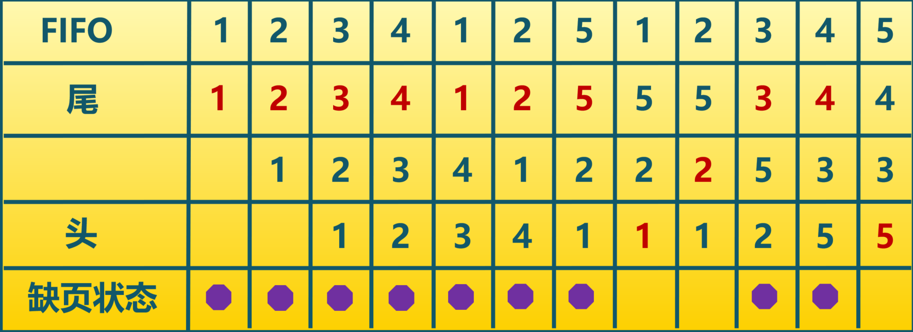


---
### Belady现象 -- FIFO算法   
访问顺序 : 1, 2, 3, 4, 1, 2, 5, 1, 2, 3, 4, 5
物理页面数: 3  ； 缺页次数: 9


---
### Belady现象 -- FIFO算法   
访问顺序 : 1, 2, 3, 4, 1, 2, 5, 1, 2, 3, 4, 5
物理页面数: 4  ； 缺页次数: 10


---
### Belady现象 -- FIFO算法   
访问顺序 : 1, 2, 3, 4, 1, 2, 5, 1, 2, 3, 4, 5
物理页面数: 4  ； 缺页次数: 10
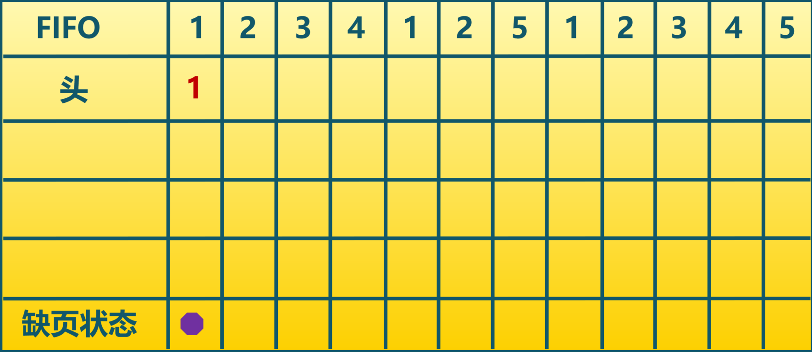


---
### Belady现象 -- FIFO算法   
访问顺序 : 1, 2, 3, 4, 1, 2, 5, 1, 2, 3, 4, 5
物理页面数: 4  ； 缺页次数: 10


---
### Belady现象 -- FIFO算法   
访问顺序 : 1, 2, 3, 4, 1, 2, 5, 1, 2, 3, 4, 5
物理页面数: 4  ； 缺页次数: 10
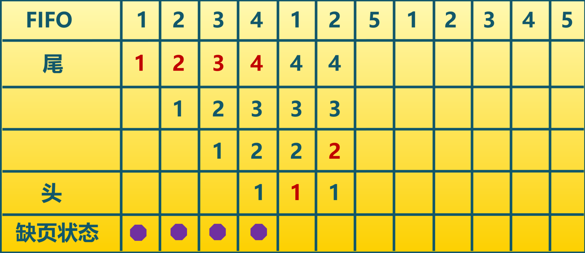


---
### Belady现象 -- FIFO算法   
访问顺序 : 1, 2, 3, 4, 1, 2, 5, 1, 2, 3, 4, 5
物理页面数: 4  ； 缺页次数: 10


---
### Belady现象 -- FIFO算法有Belady现象   


<!-- 
-->
<!-- -->

---
### Belady现象 -- LRU算法无Belady现象   


时钟/改进的时钟页面置换是否有Belady现象？
为什么LRU页面置换算法没有Belady现象？

---
### 小结
- LRU、FIFO和Clock的比较
  - LRU算法和FIFO本质上都是先进先出的思路
  - LRU依据页面的最近访问时间排序
  - LRU需要动态地调整顺序
  - FIFO依据页面进入内存的时间排序
  - FIFO的页面进入时间是固定不变的

---
### 小结
- LRU、FIFO和Clock的比较
  - LRU可退化成FIFO
    - 如页面进入内存后没有被访问，最近访问时间与进入内存的时间相同
    - 例如：给进程分配3个物理页面，逻辑页面的访问顺序为1、2、3、4、5、6、1、2、3…


---
### 小结
- LRU、FIFO和Clock的比较
  - LRU算法性能较好，但系统开销较大
  - FIFO算法系统开销较小，会发生Belady现象
  - Clock算法是它们的折衷
    - 页面访问时，不动态调整页面在链表中的顺序，仅做标记
    - 缺页时，再把它移动到链表末尾
    - 对于未被访问的页面，Clock和LRU算法的表现一样好
    - 对于被访问过的页面，Clock算法不能记录准确访问顺序，而LRU算法可以


