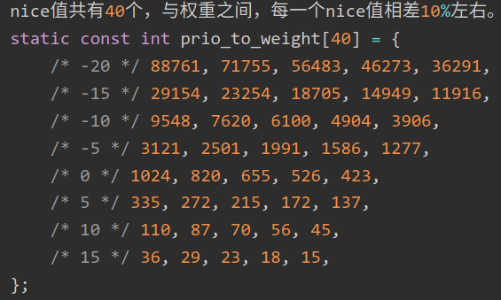

<!-- theme: gaia -->
<!-- _class: lead -->

## 第八讲 多处理器调度

### 第四节 Linux CFS 调度

---
### CFS 的思路
- 以前的 Linux 调度算法根据进程的优先级进行调度，即通过一系列运行指标确定进程的优先级，然后根据进程的优先级确定调度哪个进程
- CFS 不计算优先级，而是通过计算进程消耗的 CPU 时间（标准化以后的虚拟 CPU 时间）来确定谁来调度。从而到达所谓的公平性。

 

---
### CFS 的绝对公平性：
- 把 CPU 当做一种资源，并记录下每一个进程对该资源使用的情况，在调度时，调度器总是选择消耗资源最少的进程来运行。
- 但这种绝对的公平有时也是一种不公平，因为有些进程的工作比其他进程更重要，我们希望能按照权重来分配 CPU 资源。
 

---
### CFS 的相对公平性：
- 为了区别不同优先级的进程，就是会根据各个进程的权重分配运行时间
- 分配给进程的运行时间 = 调度周期 * 进程权重 / 所有进程权重之和
- 调度周期：将所处于 TASK_RUNNING 态进程都调度一遍的时间

 


---
### CFS 的相对公平性：
- 比如系统中只两个进程 A, B，权重分别为 1和 2，假设调度周期设为 30ms，
- A 的 CPU 时间为:30ms * (1/(1+2)) = 10ms
- B 的 CPU 时间为：30ms * (2/(1+2)) = 20ms
- 在这 30ms 中 A 将运行 10ms，B 将运行 20ms

 


---
### CFS 的实现原理：
- Linux 通过引入 virtual runtime(vruntime)
- vruntime = 实际运行时间 * 1024 / 进程权重
- 谁的 vruntime 值较小就说明它以前占用 cpu的时间较短，受到了“不公平”对待，因此下一个运行进程就是它
- 这样既能公平选择进程，又能保证高优先级进程获得较多的运行时间。

 


---
### CFS 的具体实现：
- Linux 采用了一颗红黑树（对于多核调度，实际上每一个核有一个自己的红黑树），记录下每一个进程的 vruntime
- 需要调度时，从红黑树中选取一个 vruntime最小的进程出来运行
 


---
### CFS 的具体实现：
权重如何决定？
- 权重由 nice 值确定，权重跟进程 nice 值之间有一一对应的关系
- 通过全局数组 prio_to_weight 来转换，nice值越大，权重越低。
 


---
### CFS 的具体实现：
新创建进程的 vruntime 是多少？
- 假如新进程的 vruntime 初值为 0 的话，比老进程的值小很多，那么它在相当长的时间内都会保持抢占 CPU 的优势，老进程就要饿死了，这显然是不公平的。
 

---
### CFS 的具体实现：
新创建进程的 vruntime 是多少？
- 每个 CPU 的运行队列 cfs_rq 都维护一min_vruntime 字段，记录该运行队列中所有进程的 vruntime 最小值，新进程的初始vruntime 值就以它所在运行队列的min_vruntime 为基础来设置，与老进程保持
在合理的差距范围内。
 

---
### CFS 的具体实现：
休眠进程的 vruntime 一直保持不变吗？
- 如果休眠进程的 vruntime 保持不变，而其他运行进程的 vruntime 一直在推进，那么等到休眠进程终于唤醒的时候，它的 vruntime 比别人小很多，会使它获得长时间抢占 CPU 的优势，其他进程就要饿死了。
 


---
### CFS 的具体实现：
休眠进程的 vruntime 一直保持不变吗？
- 在休眠进程被唤醒时重新设置 vruntime 值，以 min_vruntime 值为基础，给予一定的补偿，但不能补偿太多。
 


---
### CFS 的具体实现：
休眠进程在唤醒时会立刻抢占 CPU 吗？
- 休眠进程在醒来的时候有能力抢占 CPU 是大概率事件，这也是 CFS 调度算法的本意，即保证交互式进程的响应速度，因为为交互式进程等待用户输入会频繁休眠。
 


---
### CFS 的具体实现：
休眠进程在唤醒时会立刻抢占 CPU 吗？
- 主动休眠的进程同样也会在唤醒时获得补偿，这类进程往往并不要求快速响应，它们同样也会在每次唤醒并抢占，这有可能会导致其它更重要的应用进程被抢占，有损整体性能。
- sched_features 的 WAKEUP_PREEMPT 位

 


---
### CFS 的具体实现：
进程在 CPU 间迁移时 vruntime 会不会变？
- 在多 CPU 的系统上，不同的 CPU 的负载不一样，有的 CPU 更忙一些，而每个 CPU 都有自己的运行队列，每个队列中的进程的vruntime 也走得有快有慢，比如我们对比每个运行队列的 min_vruntime 值，都会有不同
 


---
### CFS 的具体实现：
进程在 CPU 间迁移时 vruntime 会不会变？
- 当进程从一个 CPU 的运行队列中出来时，它的 vruntime 要减去队列的 min_vruntime 值；
- 当进程加入另一个 CPU 的运行队列时，它的vruntime 要加上该队列的 min_vruntime 值。


 


---
### CFS 的具体实现：
vruntime 溢出问题
- 红黑树中实际的作为 key 的不是 vruntime 而是 vruntime - min_vruntime。min_vruntime 是当前红黑树中最小的 key
- vruntime 的类型 usigned long


 


---
### CFS 的具体实现：
vruntime 溢出问题
- 进程的虚拟时间是一个递增的正值，因此它不会是负数，但是它有它的上限，就是unsigned long 所能表示的最大值，如果溢出了，那么它就会从 0 开始回滚，如果这样的话，结果会怎样？


 


---
### CFS 的具体实现：
vruntime 溢出问题: 一个例子
```C
unsigned char a = 251;
unsigned char b = 254;
b += 5;
//b溢出，导致a > b，应该b = a + 8
//怎么做到真正的结果呢？改为以下：
unsigned char a = 251;
unsigned char b = 254;
b += 5;
signed char c = a - 250, 
signed char d = b - 250;
//到此判断 c 和 d 的大小
```


 