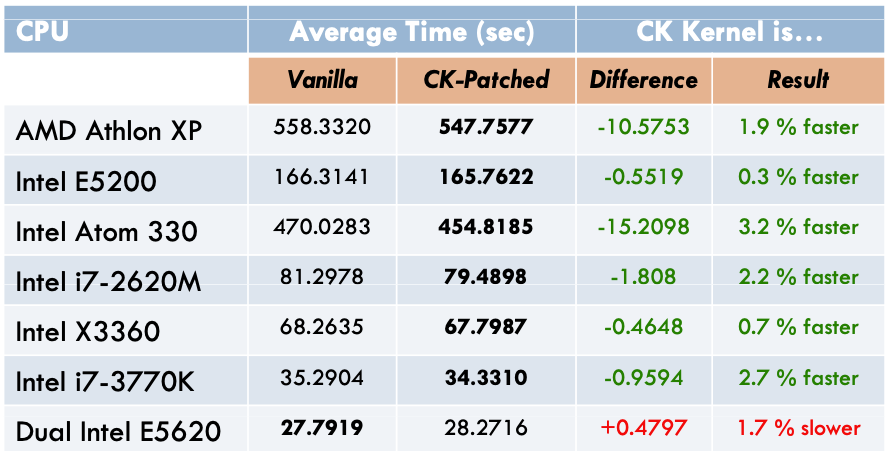
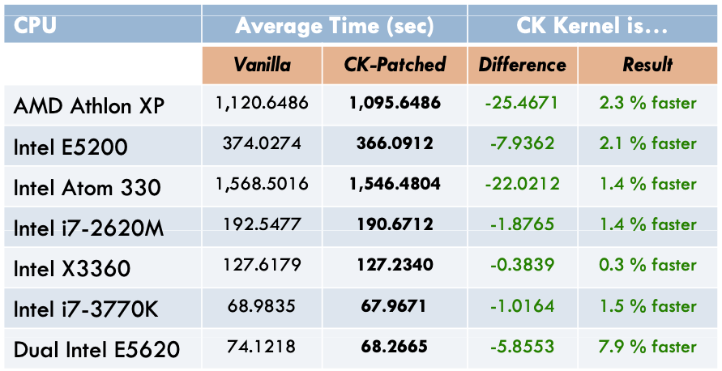
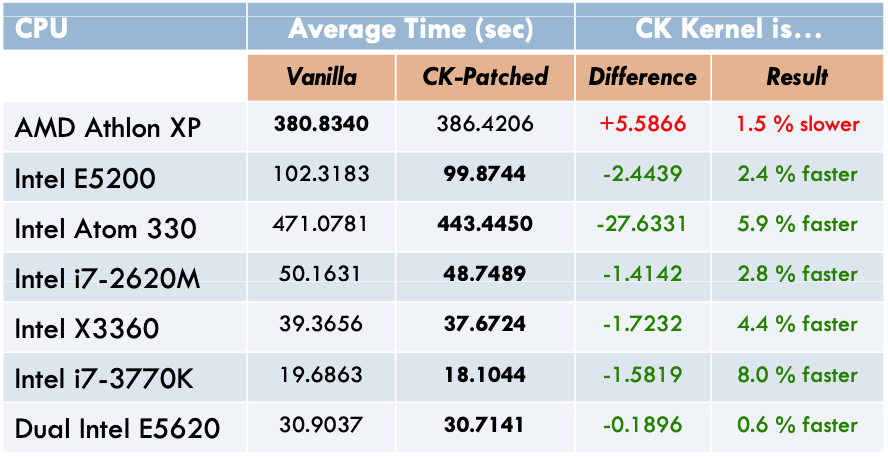

<!-- theme: gaia -->
<!-- _class: lead -->

## 第八讲 多处理器调度

### 第五节 Linux/FreeBSD BFS 调度


-- From [Analysis of the BFS Scheduler in FreeBSD](http://vellvisher.github.io/papers_reports/doc/BFS_FreeBSD.pdf)

---
### BFS 的思路
BFS全称：Brain Fu*k Scheduler，脑残调度器
- BFS 调度算法是一种时间片轮转算法的变种。
- 在多处理机情况的单就绪队列（双向链表）选择，增加了队列互斥访问的开销，但减少了负载均衡算法开销。

---
### BFS 的实现 ：就绪队列
- 进程优先级：有 103 个优先级
  - 100 个静态的实时优先级；
  - 3 个普通优先级 
      - SCHED_ISO (isochronous) : 交互式任务
      - SCHED_NORMAL  : 普通任务
      - SCHED_IDLEPRIO ：低优先级任务


---
### BFS 的实现 ：就绪队列

- 就绪队列
  - 所有 CPU 共享一个双向链表结构的单就绪队列；
  - 所有进程按优先级排队；
  - 相同优先级的每个进程有一个时间片长度和虚拟截止时间；


---
### BFS 的实现 ：时间片
- 时间片大小：小由算法参数指定，可在 1ms 到 1000ms 间选择，缺省设置为 6ms；
- 虚拟截止时间（Virtual Deadline）：它是一个关于就绪队列中进程等待 CPU 最长时间的排序，并不是真实的截止时间；
  -  进程时间片用完时，重新计算虚拟截止时间；
  - 事件等待结束时，虚拟截止时间保持不变，以抢先相同优先级的就绪进程；
  - 为了让进程在上次运行的 CPU 上运行，不同 CPU 对进程的虚拟截止时间加一个权重；


---
### BFS 的实现 ：虚拟截止时间计算
- 依据当前时间、进程优先级和时间片设置计算；
```
offset = niffies + (prioratio ∗ rr_interval)
prioratio increases by 10% for every nice level
```
- niffies是当前时间；prio_ratios[priority]是一个常量数组，不同的priority对应不同的prio_ratios[priority]；rr_interval是timeslice，是CPU分配给每个任务的时间片，是一个常数

- 虚拟截止时间计算结果：https://wikimili.com/en/Brain_Fuck_Scheduler


---
### BFS 的实现 ：调度思路
使用O(1)调度器中的位图的概念，所有进程被安排到103个queue中，各个进程不是按照优先级而是按照优先级区间被排列到各自所在的区间，每一个区间拥有一个queue。
<!-- https://www.cnblogs.com/dragonsuc/p/7144265.html -->


---
### BFS 的实现 ：调度思路
按照O(1)调度器的方式首先查找位图中不为0的那个queue，然后在该queue中执行O(n)查找，查找到virtual deadline(如下所述)最小的那个进程投入执行。


---
### BFS 的实现 ：相关进程状态置换
- 时间片用完：重新设置虚拟截止时间后，插入就绪队列；
- 等待事件出现：虚拟截止时间保持不变，抢先低优先级进程或插入就绪队列；


---
### BFS 与 CFS 的性能对比 (2012)
测试用例集
- Linux kernel v3.6.2.2 的 GCC 编译
- Linux kernel v3.6.2 内核源代码树的 lrzip 压缩
- 从 720p 到 360p 的 MPEG2 视频 ffmpeg 压缩


---
### BFS 与 CFS 的性能对比: 压缩测试


---
### BFS 与 CFS 的性能对比: 测试编译


---
### BFS 与 CFS 的性能对比: 视频编码测试


### 参考文献
- https://zhuanlan.zhihu.com/p/351876567
- https://blog.csdn.net/dog250/article/details/7459533
- https://www.cnblogs.com/dragonsuc/p/7144265.html