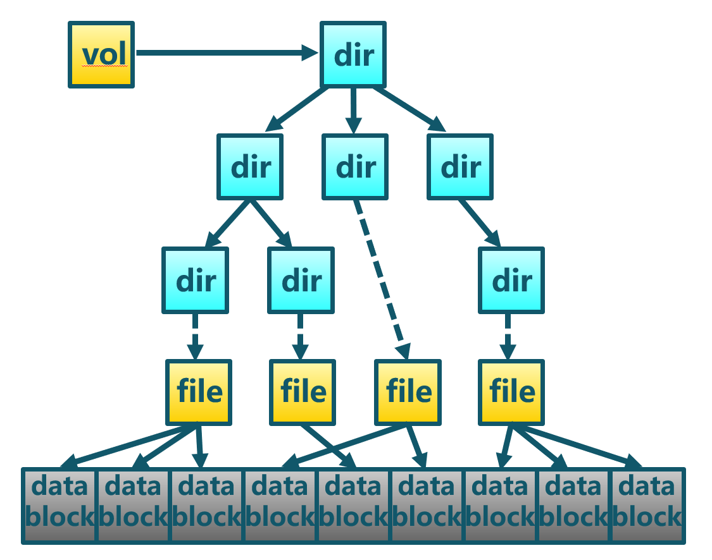
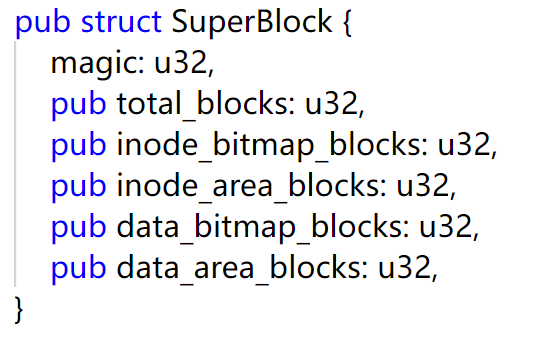
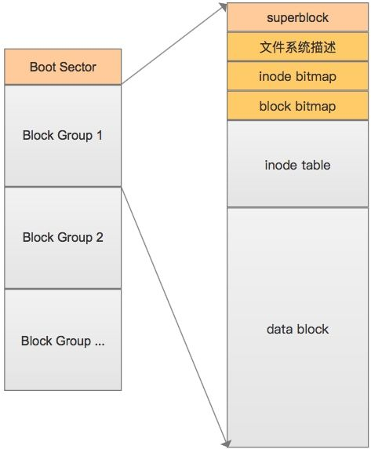

<!-- theme: gaia -->
<!-- _class: lead -->

## 第九讲 文件系统

### 第二节 文件系统的设计与实现

--- 
### 文件系统的设计与实现 -- 概述
文件系统在内核中的位置

--- 
### 文件系统的设计与实现 -- 概述
文件系统的分层结构

--- 
### 文件系统的设计与实现 -- 概述
文件系统在系统中的分层结构

--- 
### 文件系统的设计与实现 -- 概述
- 虚拟文件系统（Virtual File System，VFS），定义了一组所有文件系统都支持的数据结构和标准接口。
- 磁盘的文件系统，它是直接把数据存储在磁盘中，比如 Ext 2/3/4、XFS。
- 内存的文件系统，内存辅助数据结构 - 例如目录项。

--- 
### 文件系统的设计与实现 -- 概述
文件系统用户空间与内核空间

--- 
### 文件系统的设计与实现 -- 概述
虚拟文件系统 (VFS)
- 目的：对所有不同文件系统的抽象
- 功能
  - 提供相同的文件和文件系统接口
  - 管理所有文件和文件系统关联的数据结构
  - 高效查询例程, 遍历文件系统
  - 与特定文件系统模块的交互

--- 
### 文件系统的设计与实现 -- 概述
虚拟文件系统 (VFS)

--- 
### 文件系统的设计与实现 -- 概述
文件系统的组织视图

--- 
### 文件系统的设计与实现 -- 概述
文件系统的存储视图
- 文件卷控制块 (`superblock`)
- 文件控制块( `inode`/`vnode`)
- 目录项 (`dir_entry`)
- 数据块（`data block`）

--- 
### 文件系统的设计与实现 -- 概述
文件系统基本数据结构 

--- 
### 文件系统的设计与实现 -- 概述
文件系统基本数据结构
- 文件卷控制块 (`superblock`)
  - 每个文件系统一个
  - 文件系统详细信息
  - 块大小、空余块数量等

--- 
### 文件系统的设计与实现 -- 概述
文件系统基本数据结构
- 文件控制块( `inode`/`vnode`)
  - 每个文件一个
  - 文件详细信息
  - 数据块位置\访问权限...

--- 
### 文件系统的设计与实现 -- 概述
文件系统基本数据结构 - 目录

--- 
### 文件系统的设计与实现 -- 概述
 内存缓存
- 目录项 (`dir_entry`)
  - 每个目录项一个(目录和文件)
  - 将目录项数据结构及树型布局编码成树型数据结构
  - 指向文件控制块、父目录、子目录等

--- 
### 文件系统的设计与实现 -- 缓存
多种磁盘缓存位置

--- 
### 文件系统的设计与实现 -- 缓存
- 数据块缓存
  - 数据块按需读入内存
    - 提供read()操作
    - 预读: 预先读取后面的数据块
  - 数据块使用后被缓存
    - 假设数据将会再次用到
    - 写操作可能被缓存和延迟写入
 
 页缓存: 统一缓存数据块和内存页

--- 
### 文件系统的设计与实现 -- 缓存
虚拟页式存储 -- 页缓存
- 在虚拟地址空间中虚拟页面可映射到本地外存文件中
  

--- 
### 文件系统的设计与实现 -- 缓存
虚拟页式存储 -- 页缓存
- 在虚拟地址空间中虚拟页面可映射到本地外存文件中
- 文件数据块的页缓存
  - 在虚拟内存中文件数据块被映射成页
  - 文件的读/写操作被转换成对内存的访问
  - 可能导致缺页和/或设置为脏页
  - 问题: 页置换算法需要协调虚拟存储和页缓存间的页面数

--- 
### 文件系统的设计与实现 -- 文件描述符
文件描述符
- 每个被打开的文件都有一个文件描述符
- 作为index，指向对应文件状态信息

--- 
### 文件系统的设计与实现 -- 文件描述符
打开文件表
- 每个进程一个进程打开文件表
- 一个系统级的打开文件表

--- 
### 文件系统的设计与实现 -- 文件锁
一些文件系统提供文件锁，用于协调多进程的文件访问
- 强制 – 根据锁保持情况和访问需求确定是否拒绝访问
- 劝告 – 进程可以查找锁的状态来决定怎么做

--- 
### 文件系统的设计与实现
文件大小
- 大多数文件都很小
  - 需要支持小文件
  - 数据块空间不能太大
- 一些文件非常大
  - 能支持大文件
  - 可高效读写

--- 
### 文件系统的设计与实现
文件分配：分配文件数据块
- 分配方式
   - 连续分配
   - 链式分配
   - 链式分配
- 评价指标
  - 存储效率：外部碎片等
  - 读写性能：访问速度

--- 
### 文件系统的设计与实现 -- 文件分配
（1）连续分配: 文件头指定起始块和长度

- 分配策略: 最先匹配, 最佳匹配, ...
- 优点: 高效的顺序和随机读访问
- 缺点: 频繁分配会带来碎片；增加文件内容开销大

--- 
### 文件系统的设计与实现 -- 文件分配
（2）链式分配: 数据块以链表方式存储

- 优点: 创建、增大、缩小很容易；几乎没有碎片
- 缺点：
   - 随机访问效率低；可靠性差；
   - 破坏一个链，后面的数据块就丢了

--- 
### 文件系统的设计与实现 -- 文件分配
- 文件头包含了索引数据块指针
- 索引数据块中的索引是文件数据块的指针

- 优点：创建、增大、缩小很容易；几乎没有碎片；支持直接访问
- 缺点：当文件很小时，存储索引的开销相对大

如何处理大文件?

--- 
### 文件系统的设计与实现 -- 文件分配
（3）索引分配
- 链式索引块 (IB+IB+…)

- 多级索引块(IB*IB *…)

--- 
### 文件系统的设计与实现 -- 文件分配
（3）索引分配

--- 
### 文件系统的设计与实现 -- 文件分配
（3）多级索引分配

--- 
### 文件系统的设计与实现 -- 文件分配
（3）多级索引分配
- 文件头包含13个指针
  - 10 个指针指向数据块
  - 第11个指针指向索引块
  - 第12个指针指向二级索引块
  - 第13个指针指向三级索引块

大文件在访问数据块时需要大量查询

--- 
### 文件系统的设计与实现 -- 空闲空间管理
- 跟踪记录文件卷中未分配的数据块: 数据结构?
- （1）位图
  - 用位图代表空闲数据块列表
    - 11111111001110101011101111...
    - $D_i = 0$ 表明数据块$i$是空闲, 否则，表示已分配
    - 160GB磁盘 --> 40M数据块 --> 5MB位图
    - 假定空闲空间在磁盘中均匀分布，
       - 找到“0”之前要扫描n/r 
         - n = 磁盘上数据块的总数 ； r = 空闲块的数目

--- 
### 文件系统的设计与实现 -- 空闲空间管理 
- （2）链表

- （3）索引

 

--- 
### 文件系统的设计与实现 - 总结

--- 
### 文件系统的设计与实现 - 分区
- 多数磁盘划分为一个或多个分区，每个分区有一个独立的文件系统。

